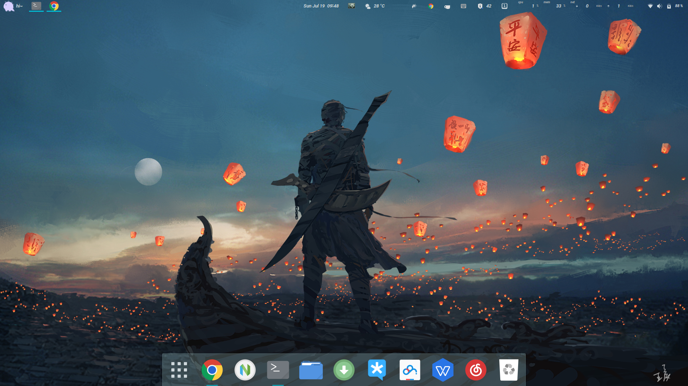
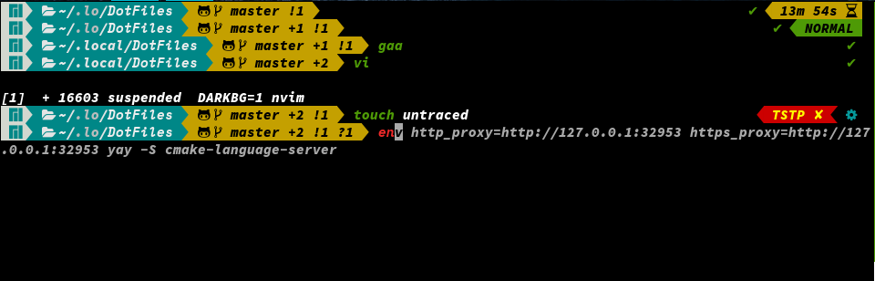
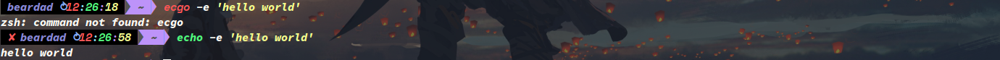
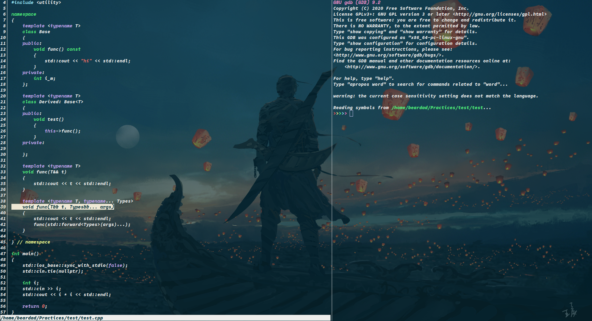

# 目录
<!-- vim-markdown-toc GFM -->

- [安装](#安装)
- [详细介绍](#详细介绍)
  - [Gnome桌面环境](#gnome桌面环境)
    - [全局按键](#全局按键)
    - [窗口操作](#窗口操作)
    - [截图与录屏](#截图与录屏)
    - [文件管理器操作](#文件管理器操作)
    - [下拉式终端操作](#下拉式终端操作)
  - [桌面软件](#桌面软件)
    - [关于deepin-wine-tim与deepin-wine-wechat](#关于deepin-wine-tim与deepin-wine-wechat)
  - [Grub启动加载器](#grub启动加载器)
  - [SSH远程连接服务器](#ssh远程连接服务器)
  - [zsh命令行Shell](#zsh命令行shell)
    - [好看](#好看)
    - [好用](#好用)
    - [踩过的坑](#踩过的坑)
  - [tmux终端复用器](#tmux终端复用器)
    - [踩过的坑：](#踩过的坑-1)
  - [xfce4-terminal终端](#xfce4-terminal终端)
  - [gdb调试器](#gdb调试器)
  - [chfs](#chfs)
  - [fcitx5-rime输入法](#fcitx5-rime输入法)
  - [neovim编辑器](#neovim编辑器)

<!-- vim-markdown-toc -->

# 安装
提供了shell脚本用于安装配置**Manjaro21**，**Manjaro20版本**见 [c21fb8](https://github.com/mrbeardad/DotFiles/tree/c21fb82e74f9fc2e96ed670037213f85f20211e6)

**小贴士**：在安装之前，需要你需要做两件事
1. 修改 */etc/sudoers* 与 */etc/sudoers.d/\** ，使whell组的`sudo`可执行所有命令且无需密码，
并将平时使用的普通用户加入wheel组；

2. 确保你的网络环境OK，注意不要更改 */etc/pacman.conf* 。

准备妥当后，执行
```sh
git clone --depth=1 https://github.com/mrbeardad/DotFiles ~/.local/DotFiles
cd ~/.local/DotFiles
./init.sh
```

# 详细介绍
[init.sh](init.sh)脚本中已经写了注释，可以直接打开看看执行流程，不懂bash语法也无关系哦

## Gnome桌面环境
&emsp;Gnome作为最流行的DE之一，总是少不了争议，卡是确实有点卡，不知道是X的锅还是gnome的（或者鱼与熊掌都下锅？）。
开源的事儿，怎么能甩锅给他们呢，那还是Fxxk Nvidia吧。我没用过其它桌面环境，就不多评价了。

**注意**：<kbd>Super</kbd>也就是<kbd>Win</kbd>

### 全局按键
| 按键                             | 功能                                   |
|----------------------------------|----------------------------------------|
| <kbd>Super</kbd>                 | 打开“开始”菜单                         |
| <kbd>Super</kbd>+<kbd>S</kbd>    | 打开窗口总览                           |
| <kbd>Super</kbd>+<kbd>A</kbd>    | 列出本地所有已安装应用                 |
| <kbd>Super</kbd>+<kbd>数字</kbd> | 启动底部工具栏第n个软件                |
| <kbd>Super</kbd>+<kbd>N</kbd>    | 打开通知窗口（可顺便查看天气、日历等） |
| <kbd>Super</kbd>+<kbd>R</kbd>    | 打开运行窗口，`r`重启X                 |
| <kbd>Super</kbd>+<kbd>I</kbd>    | 打开系统设置                           |
| <kbd>Super</kbd>+<kbd>E</kbd>    | 打开文件管理器                         |
| <kbd>Super</kbd>+<kbd>L</kbd>    | 锁屏                                   |

### 窗口操作
| 按键                                           | 功能                     |
|------------------------------------------------|--------------------------|
| <kbd>Super</kbd>+<kbd>D</kbd>                  | 显示桌面                 |
| <kbd>Super</kbd>+<kbd>H</kbd>                  | 隐藏窗口                 |
| <kbd>Super</kbd>+<kbd>↑</kbd>                  | 最大化窗口               |
| <kbd>Super</kbd>+<kbd>↓</kbd>                  | 还原窗口大小             |
| <kbd>Super</kbd>+<kbd>Q</kbd>                  | 关闭窗口                 |
| <kbd>Super</kbd>+<kbd>←</kbd>                  | 当前窗口左分屏           |
| <kbd>Super</kbd>+<kbd>→</kbd>                  | 当前窗口右分屏           |
| <kbd>Super</kbd>+<kbd>Y</kbd>                  | 开启/关闭自动分屏模式    |
| <kbd>Super</kbd>+<kbd>tab</kbd>                | 切换窗口                 |
| <kbd>Ctrl</kbd>+<kbd>Alt</kbd>+<kbd>↑</kbd>    | 上个工作区               |
| <kbd>Ctrl</kbd>+<kbd>Alt</kbd>+<kbd>↓</kbd>    | 下个工作区               |
| <kbd>Super</kbd>+<kbd>Shift</kbd>+<kbd>↑</kbd> | 将当前窗口移至上个工作区 |
| <kbd>Super</kbd>+<kbd>Shift</kbd>+<kbd>↓</kbd> | 将当前窗口移至下个工作区 |

### 截图与录屏
| 按键                                              | 功能                         |
|---------------------------------------------------|------------------------------|
| <kbd>Ctrl</kbd>+<kbd>Alt</kbd>+<kbd>R</kbd>       | 录屏                         |
| <kbd>Ctrl</kbd>+<kbd>Alt</kbd>+<kbd>A</kbd>       | 截图                         |
| <kbd>PrtSc</kbd>                                  | 保存桌面截图到~/Pictures     |
| <kbd>Ctrl</kbd>+<kbd>PrtSc</kbd>                  | 保存截图到系统剪切板         |
| <kbd>Super</kbd>+<kbd>PrtSc</kbd>                 | 保存当前窗口截图到~/Pictures |
| <kbd>Ctrl</kbd>+<kbd>Super</kbd>+<kbd>PrtSc</kbd> | 保存当前窗口截图到系统剪切板 |

### 文件管理器操作
| 按键                                          | 功能          |
|-----------------------------------------------|---------------|
| <kbd>Ctrl</kbd>+<kbd>A</kbd>                  | 选择全部      |
| <kbd>Ctrl</kbd>+<kbd>C</kbd>                  | 复制          |
| <kbd>Ctrl</kbd>+<kbd>X</kbd>                  | 剪切          |
| <kbd>Ctrl</kbd>+<kbd>V</kbd>                  | 粘贴          |
| <kbd>Ctrl</kbd>+<kbd>F</kbd>                  | 搜索          |
| <kbd>Ctrl</kbd>+<kbd>Z</kbd>                  | 撤销          |
| <kbd>Ctrl</kbd>+<kbd>Shift</kbd>+<kbd>Z</kbd> | 取消撤销      |
| <kbd>Ctrl</kbd>+<kbd>H</kbd>                  | 显示/隐藏文件 |
| <kbd>Ctrl</kbd>+<kbd>D</kbd>                  | 固定到快捷栏  |
| <kbd>Ctrl</kbd>+<kbd>T</kbd>                  | 打开新Tab     |
| <kbd>Ctrl</kbd>+<kbd>W</kbd>                  | 关闭Tab       |
| <kbd>/</kbd>                                  | 根目录        |
| <kbd>~</kbd>                                  | 家目录        |

### 下拉式终端操作
| 按键                                          | 功能                |
|-----------------------------------------------|---------------------|
| <kbd>Alt</kbd>+<kbd>Enter</kbd>               | 下拉或隐藏终端窗口  |
| <kbd>F11</kbd>                                | 切换全屏状态        |
| <kbd>Ctrl</kbd>+<kbd>Shift</kbd>+<kbd>C</kbd> | 复制                |
| <kbd>Ctrl</kbd>+<kbd>Shift</kbd>+<kbd>V</kbd> | 粘贴                |
| <kbd>Ctrl</kbd>+<kbd>Alt</kbd>+<kbd>H</kbd>   | htop系统资源监控    |
| <kbd>Ctrl</kbd>+<kbd>Alt</kbd>+<kbd>G</kbd>   | bashtop系统资源监控 |
| <kbd>Ctrl</kbd>+<kbd>Alt</kbd>+<kbd>I</kbd>   | iotop磁盘IO监控     |
| <kbd>Ctrl</kbd>+<kbd>Alt</kbd>+<kbd>M</kbd>   | cmatrix屏保         |

> 矩阵革命来一波( ◔ ڼ ◔  )


## 桌面软件
### 关于deepin-wine-tim与deepin-wine-wechat
这两移植的软件在第一次运行时可能会报错，重启一次就行了。
若无法输入中文的话，检查你的机器是否支持中文：`locale -a`。
若无`zh_CN.UTF-8`则打开/etc/locale.gen取消注释中文那行再运行`sudo locale-gen`

## Grub启动加载器
&emsp;系统启动加载器（bootloader），由固件启动并加载*Linux Kernel*并为其提供参数，
如果你装的双系统，则需要它提供选单来在开机是决定进入哪个OS。

* 你可以用你喜欢的图片替换`/usr/share/grub/themes/manjaro/background.png`，
注意图片的名字、格式、分辨率都得一样哦，如果还不行那就用gThumb打开图片，然后点击右上角的🔧️按钮，
选择`Delete Metadata`

> 本来是打算安装breeze-grub的，但是AUR这个包有bug，可以去<gnome-look.org>手动下载

* 现在你只需要在`/boot/grub/user.cfg`中定义变量`GRUB_PASSWORD`为`密码`即可为grub设置密码来防止篡改选单内容
```sh
# 输入两次密码，此命令会输出加密后的密码
$ grub-mkpasswd-pbkdf2

# 然后把密码写入/boot/grub/user.cfg，没有该文件就自己建一个
$ vim /boot/grub/user.cfg

# 最后/bot/grub/user.cfg中应该设置成这样
GRUB_PASSWORD=grub.pbkdf2.sha512.一长串密码
```
## SSH远程连接服务器
&emsp;安全外壳协议，OpenSSH是它的一个实现。
有了它你就可以安全、方便地远程连接你的主机，连上后取得你的shell，就像在本地登录一样。
它通过[非对称加密技术](https://github.com/mrbeardad/SeeCheatSheets/blob/master/notes/bitcoin.md)为你和主机之间建立安全隧道，故**公私钥对**是必不可少的。
当然你可以使用你的用户密码登录而不用密钥，如果你的主机暴露在互联网中那当然是不推荐的。
* `~/.ssh/ssh_config`，用于git通过ssh协议链接github与gitee
    > 这个你得自己把`ssh/ssh_config`复制到你的`~/.ssh`下，因为这是我自己的配置，
    > 你得自己创建**公私钥对**才能用，若不知道可以google，也可以用命令`$ see ssh`查看

* `/etc/ssh/sshd_config`，用于手机ssh链接电脑，端口改为50000
    > 本来想设置只允许密钥链接的，结果我手机上用的**JuiceSSH**，它生成的公钥电脑上无法识别，
    > 电脑上生成的私钥它又无法识别。要是有万能的网友朋友知道，提个issue呀:smile:

* 安装`/etc/hosts`文件，手动解析github的域名，访问更快速。  
    注：现在启用本地DNS服务器解析域名
    > (*￣︿￣)现在是不是就被墙一下，搞的我们很难受呀。  
    > 要是速度仍然慢，或者有些域名直接无法访问，那就照着自己改改，
    > 去[这个网站](https://www.ipaddress.com/)上测试一下域名对应的IP


## zsh命令行Shell
代替**bash**，强有力的生产工具，当然写脚本还是得用bash  
相较与bash，zsh主要的有点是**好看**与**好用**
### 好看
> manjaro21自带的主题似乎更好看0.0
> 

**提示符**  

很奈斯的提示符是吧，从左到右分别是：
* 状态提示符
* 用户名
* 时间
* 当前目录
* git分支
* git状态
* vi-mode提示  
>

状态提示符会出现3种符号：
* `✘`表示上个命令返回非零
* `⚡`表示当前用户为root
* `⚙`表示后台有作业
>

  
  
git状态：
* 背景为黄色代表**工作区**不干净，反之则为绿色
* ` master`代表分支名，`➦ a53b99b`代表HEAD指向`a53b99b`的提交
* `⬍`表示工作区相对暂存区有变更，`⥥` 表示暂存区有待提交

**语法高亮**  
  
对命令行进行语法高亮，大大减少了输入错误语法的可能

**命令推荐**  
  
每次输入命令时，都会自动搜索历史命令，并找出匹配已输入的命令的历史，然后推荐给你。
你只需要按`→`即可应用它推荐的历史命令

### 好用
**vi-mode**  
* <kbd>Esc</kbd>或<kbd>Ctrl</kbd>+<kbd>\[</kbd>：进入vi-mode，可以使用vi形式的快捷键更方便的修改命令
* <kbd>/</kbd>：搜索历史命令

* <kbd>v</kbd>：按快捷键v可打开`$EDITOR`编辑命令
>

**命令**  
* 提供了大量的命令别名，其中最主要的就是git的命令别名

* `r`：重复上次命令
* `x`：该命令可以智能解压各种压缩包
* `o`：`xdg-open`的别名，用于使用默认图形应用打开目标文件
* `j`：该命令会根据你`cd`的频率，智能、模糊化地跳转到目标目录
* `f`：该命令启动[fzf](https://github.com/junegunn/fzf)并用[ranger](https://github.com/ranger/ranger)打开选择的文件，
    若用[init.sh](init.sh)安装的话默认都会显示所有隐藏文件
* `fuck`：该命令帮助修改上次错误的命令，解气由实用，提高祖安手速
>
### 踩过的坑
* 开启`vi-mode`会导致`history-substring-search`失效。  
    解决办法是手动设置映射
* 使用`syntax-highlight`会让终端复制极其之慢，原因是该插件会对每个复制的字符进行检测。  
    解决办法是给该插件设置一下

## tmux终端复用器
终端分屏工具和环境保护工具：
* 首先是分屏：  
  如果只是在本地登录，那这相较于终端模拟器的分屏没有啥区别，
  但如果你是通过ssh连接远程主机的，那你就很需要它了，因为tmux分出的屏都是在同一个session中，
  不然你得重新再用ssh连接主机然后再同时进行多个前台任务。
* 然后是环境保护：  
  使用C/S模型，你所做的操作都由tmux服务端接管，当你意外退出或断线时，你的任务都会被tmux保留，
  你只需重新用ssh连接主机在连接tmux即可回复现场，而不用再一个个的打开工作窗口，甚至丢失一些进度

默认把状态栏啥的都关了，你要不确定是不是在tmux里，就按<kbd>Alt</kbd><kbd>W</kbd>+<kbd>w</kbd>试试

* **使用方法：**
    > <kbd>Alt</kbd><kbd>W</kbd> 为快捷键前缀，<u>**以下快捷键会省略写出前缀**</u>
    * pane操作：
        * <kbd>s</kbd>：水平切分panes
        * <kbd>v</kbd>：竖直切分panes
        * <kbd>x</kbd>：关闭当前pane
        * <kbd>z</kbd>：最大化该pane或恢复大小
        * <kbd>方向键</kbd>：跳转到该方向的pane
        * <kbd>q</kbd>：选择一个pane
        * <kbd>Ctrl</kbd>+<kbd>o</kbd>：交换pane
        * <kbd>!</kbd>：新窗口打开该pane
    * window操作：
        * <kbd>b</kbd> 上一个window
        * <kbd>n</kbd> 下一个window
    * session操作：
        * <kbd>d</kbd>：卸离会话(可通过`tmux a -t session-name`重新恢复)
        * <kbd>w</kbd>：预览整个会话窗口
        * <kbd>Ctrl</kbd>+<kbd>S</kbd>：保存会话到磁盘文件
        * <kbd>Ctrl</kbd>+<kbd>R</kbd>：从磁盘文件恢复会话
    * copy模式：
        * <kbd>\[</kbd>：进入copy-mode
        * <kbd>Space</kbd>：选取(copy-mode)
        * <kbd>Ctrl</kbd>+<kbd>V</kbd>+<kbd>Space</kbd>：块选取(copy-mode)
        * <kbd>/</kbd>：搜索(copy-mode)
        * <kbd>Enter</kbd>：复制(copy-mode)
        * <kbd>p</kbd>：粘贴
    * 其他操作：
        * <kbd>R</kbd>：重载配置，某些配置重载是没用的，需要重启tmux服务
        * <kbd>:</kbd>：命令模式
        * <kbd>h</kbd>：打开htop
        * <kbd>g</kbd>：打开bashtop
        * <kbd>r</kbd>：打开ranger
        * <kbd>f</kbd>：打开fzf
        * <kbd>m</kbd>：打开cmatrix

### 踩过的坑：
* 按键序列被截获并更改，导致vim里面的映射失效
* 开启终端真色
* 开启`undercurl`并支持其特殊颜色

* 如果你的neovim剪切板使用的是`xsel`，有时重启X是会导致其失效，因为`$DISPLAY`环境变量在重启X时已经更改了，
    而neovim不知道，当你在tmux运行neovim的时候就会出现这bug，因为tmux也不知道`$DISPLAY`变了，而neovim以致被它接管着，
    所以解决办法就是重启tmux，`tmux kill-server`把tmux服务杀了在重启。所有在终端启动图形程序的操作都会有这问题

## xfce4-terminal终端
现在分析一波[xfce4-terminal](https://github.com/xfce-mirror/xfce4-terminal)与[alacritty](https://github.com/alacritty/alacritty)的区别：
* alacritty优点：
    * GPU加速是它的卖点，最快的终端模拟器，莫的之一

    * 可以取消 <a href=## title="就是窗口顶部有开关、放大缩小的哪个bar">顶栏</a>
    的显示，看起来更加清爽
    * 可以对**Regular** **Bold** **Italic**三种Style使用不同字体，这是非常nice的，
    特别是在vim下开gruvbox主题就会有**Bold** Style区分，两种字体看起来特别清晰
* alacritty缺点：
    * 不支持fcitx5单行模式，这是因为它没用gtk也没用qt

    * 没有响铃警报，只有可视铃，就是本该响铃的时候屏幕闪一下，可以配置闪的那下的颜色
        > 在官方的issue下看到了一个响铃的issue和merge，但是还是没配置出来  
        > 当然这一条其实无伤大雅，可视铃已经够用了，而且实在要铃声可以配置tmux，
        > 我把我的tmux.conf里有关这个的给注释了，有兴趣可以看看
    * 中文字体丑陋，但是终端下选字体肯定首先考虑西文字体呀
    * emoji字体无法显示：  
        其实这最后三条都与alacritty没用使用gtk有关，我的DE是gnome，主打gtk，
        gtk应用搜寻字体时会由fontconfig安排字体回滚顺序，若在应用使用的字体中若没有搜索到对应字体，
        则会使用在其他字体中搜索，所以在gtk应用我可以同时拥有好看的中文字体与西文字体，
        还有大量大量的**emoji**字体

&emsp;综上，为了弥补alacritty的缺点，我需要找一个基于gtk的终端模拟器。
同时，为了保留其优点2，我需要在一众gtk TE中选择能够取消顶栏的；
为了保留其优点3，我需要合并字体（[fonts目录](fonts))，以让**Regular**、**Bold**与**italic**使用不同字形；

**当 ！当 ！当 ！当 ！**  

**Xfce4-terminal**满足所有需求，童叟无欺。配置在xfce4-terminal目录下，与guake一样，会自动运行tmux

## gdb调试器
终端调试器，程序出错了，可以设置断断点，跟踪变量值等等操作，找出产生非预期结果的代码



* 该配置大部分来自网络，提供了一些额外命令比如`pvector`、`pstring`之类的更好地打印容器元素
* 下载cgdb，一个gdb的wrapper，按 <kbd>a</kbd>进入gdb-mode，按<kbd>Esc</kbd>或<kbd>Ctrl</kbd>+<kbd>\[</kbd>进入vi-mode，一下为vi-mode中的快捷键
    * <kbd>/</kbd>与 <kbd>?</kbd>快速搜索
    * <kbd>:</kbd>进入命令模式
    * <kbd>space</kbd>设置断点
    * [更多gdb命令](https://github.com/mrbeardad/SeeCheatSheets/blob/master/notes/devtool.md)

真正调试的话，脚本下载了更好用的[gdbgui](https://github.com/cs01/gdbgui)，
里面可以使用gdb命令，所以学好gdb命令很有必要


## chfs
[一个小型局域网web](http://iscute.cn/chfs)，方便手机与电脑传文件，当然用wine.qq也很方便，不过wine.qq没法在局域网共享资源吧
* `init.sh`默认安装并设置了开机自动启动它，使用`ip a`查看主机的ip地址，然后用浏览器访问就ok，端口是50001

## fcitx5-rime输入法
&emsp;fcitx5是一个输入框架。Rime是一个输入法引擎，高度自定义。  
Linux称作中州韵，Windows小狼毫，Mac鼠须管。作者文化人，仰慕！

&emsp;开启了**全拼**、**双拼**与**英文**，默认双拼。
修改`~/.local/share/fcitx5/rime/default.custom.yaml`中的顺序即可更改默认方案。  

常用快捷键：  

| 按键                          | 功能               |
|-------------------------------|--------------------|
| <kbd>Ctrl</kbd>+<kbd>\`</kbd> | 选单               |
| <kbd>Shift_L</kbd>            | 切换中英文         |
| <kbd>Ctrl</kbd>+<kbd>.</kbd>  | 切换中西文标点符号 |
| <kbd>Ctrl</kbd>+<kbd>;</kbd>  | 系统剪切板         |
| <kbd>\`</kbd>                 | 笔画反查           |

默认提供了几款皮肤，可用fcitx5配置工具修改，若不合口味则可利用[ssfconv](https://github.com/fkxxyz/ssfconv)转换搜狗输入法的皮肤

&emsp;**注意**：词库需要由`yaml`格式转换成二进制格式，有时会重新执行这一过程，需要点时间

## neovim编辑器
vim/neovim是现在最流行的编辑器之二。  
通过编写脚本与安装插件，可以让双手打字有飞一般的感觉  
这个配置单独一个仓库，[传送门](https://github.com/mrbeardad/SpaceVim)  
vim目录下的配置是以前用vim是自己搭的，现在转neovim了，并把配置都转移到了spacevim里  

