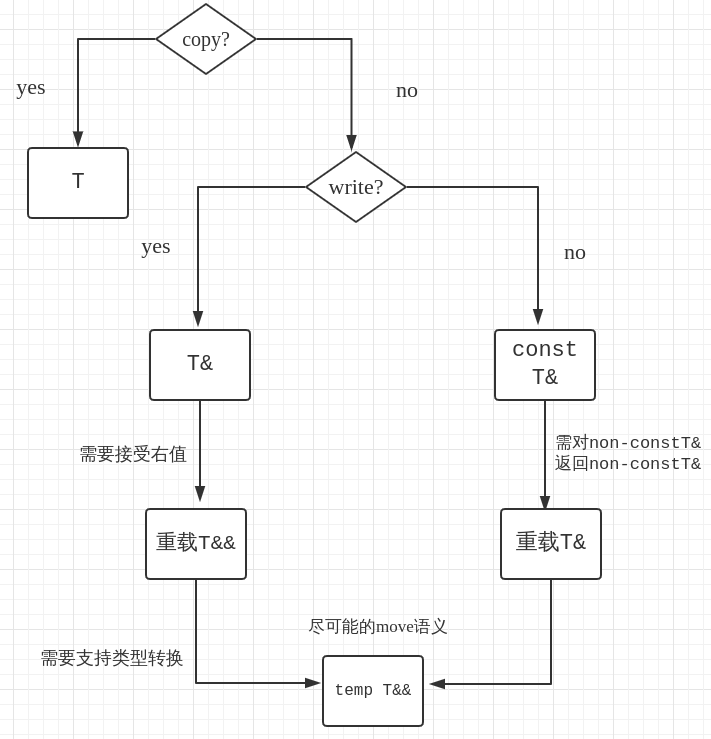

<!-- vim-markdown-toc GFM -->

- [命名空间](#命名空间)
- [全局变量](#全局变量)
  - [关键字](#关键字)
  - [inline语义](#inline语义)
- [函数](#函数)
  - [关键字](#关键字-1)
  - [其它特性](#其它特性)
- [可调用对象](#可调用对象)
- [类](#类)
  - [声明与定义](#声明与定义)
  - [成员](#成员)
  - [合成的拷贝控制成员何时deleted](#合成的拷贝控制成员何时deleted)
- [特殊的类](#特殊的类)
  - [字面值类](#字面值类)
  - [聚合类](#聚合类)
  - [枚举类](#枚举类)
  - [联合类](#联合类)
  - [嵌套类](#嵌套类)
  - [using用法](#using用法)
- [语句](#语句)
- [表达式](#表达式)
- [面向对象之继承](#面向对象之继承)
- [泛型编程](#泛型编程)
- [预处理](#预处理)
- [其他特性](#其他特性)

<!-- vim-markdown-toc -->
> 一下语法特性的讲述的顺序，是按编写一个源码文件的先后顺序排列的，从外到内，从全局元素到局部元素  
> 混合了C++11/14/17/20的标准，分不清了。。。20标准只涉及了一点点  
> 这个笔记有[精简版](http://note.youdao.com/noteshare?id=7e236a03f9b1f9338a46c792fb7c2a19)用于快速浏览和回忆

# 命名空间
* 基本用法
    > `namespace std { }`
    > * 第一次声明为定义，以后为打开
    > * 成员可定义在命名空间外，但必须在同一个文件
    * 普通、嵌套、内联：版本库
    * 无名&emsp;&emsp;&emsp;&emsp;&emsp;&emsp;：不对外链接
    * 全局&emsp;&emsp;&emsp;&emsp;&emsp;&emsp;：对外链接
* 普通命名空间
    * 通过`#include <header>`包含嵌套与内联命名空间时，
        应该先在外声明`<header>`中的标准库头文件以避免嵌套报错
* 嵌套命名空间
    * 定义在另一个命名空间中
    * 或者 `namespace A::B`
* 内联命名空间
    * inline必须出现在第一次定义处
    * 可能与原空间中名字冲突
* 无名命名空间
    * 其内成员为不对外链接
* 全局命名空间
    * 通过`::member`引用时，不与无名命名空间中成员冲突，但仍会与内联命名空间成员冲突
* 命名空间别名
    * `namespace AB = A::B`
* 声明与定义
    * 头文件中的函数与全局变量，要么只提供声明并在lib中提供定义，要么提供inline定义
>

# 全局变量
## 关键字
* const与constexpr：  
    默认不对外，因为希望用户在每个源文件中提供常量定义以优化，可以使用extern强制对外
>

## inline语义
* 对函数：
    * 提示编译器内联展开优化
    * 若展开失败则保证所有同名inline链接到同一定义
* 对全局变量：
    * 将所有编译单元(**TU**)的同名inline变量链接到同一定义
* 对类的static数据成员：
    * 为模板类提供了定义static数据成员的机制，避免使用[实例化控制](#控制实例化)的缺陷与麻烦
>

# 函数
## 关键字
* inline：  
    提示编译器内联展开，减少函数调用开销
* constexpr：
    * 隐式inline
    * 提示编译器，传入constexpr则返回consexpr
        > 注：将返回结果赋值给constexpr变量才有效
    * 使用限制：
        * 函数：constexpr
        * 变量：字面值类型
        * 声明：除了static、thread_local、未初始化变量
        * 语句：if、switch、all-loop(限制循环次数)
        * 表达式：包括lambda
        * 返回：必须有return语句
* operator：  
    * 重载运算符，包括new、""s等
* noexcept：
    * 用法：
        * `noexcept`
        * `noexcept(bool)`
        * `noexcept(func)`
            > 只要func声明了noexcept，或没有调用non-noexcept函数且无throw语句，则为ture  
            > 一般嵌套再第二种用法中
    * 提示编译器不会抛出异常以进行优化，若最终还是抛出了异常则直接终止程序
    * 限定了**指针**与**虚函数**对noexcept属性的传递
    * 合成的拷贝控制会有合成的noexcept声明，自定义的析构函数若不显式指定也会合成
    * 放置位置：const和引用限定后，尾置返回之前，final、override、=0 之前
* return：
    * 若无return语句且返回类型为内置类型(不能为类类型)，则默认在最后添加`return 0;`
    * 默认使用移动构造返回对象
    * 返回类型推断：
        * auto
        * deltype(auto)
        > 注：递归调用之前必须有return以确定返回类型
>

## 其它特性
* static变量
    * 静态变量，随函数的链接引用而被引用
>

* 默认实参
    * 若某一形参有默认实参，则其后的形参也必须有
    * 大概率用不到的默认实参的形参则应排在前面
>

* 重载函数
    * 不允许定义形参列表相同的同名函数，即使返回类型不同
>

    * 重载函数之间可通过函数指针区分(函数签名不同)
>

    * 函数匹配：按规则参数依次匹配，最后有默认实参的参数位可以不用匹配
>

    * 模板函数若推断某实例符合则也纳入候选函数，但更特例化的优先
>

    * 使用[using声明](#using声明)可以引入所有重载函数
>

    * 匹配规则(优先级降序)
        * 精准匹配、数组与函数蜕化、顶层const
        * 非底层const转底层const
        * 整型提升
        * 其他内置类型转换
        * 与类有关的类型转换
>

* 函数查找
    * 调用函数时，根据实参的类型还会到到相应命名空间中查找匹配的函数
        > 注：若形参为内置类型，则只会常规查找作用域  
        > 注：显示指定模板参数的模板函数的ADL为*c++2a extension*
>

# 可调用对象
* 可调用对象
    * 调用形式：
        * 函数(函数指针)
        * 成员函数
        * 成员函数指针
    * 传递形式：
        * 函数指针
        * 类对象
        * 成员函数指针
    * 对比优劣：
        * 函数对象：状态、类型、优化
        * Lambda：便捷、直观、无default构造函数
    * 编译时确定：利用模板参数
    * 运行时确定：利用function<>
>

* 函数参数
    * T：拷贝
    * T&：引用、左值(非常量)
    * T&&：引用、右值
    * const T&：引用、左值、右值、只读、类型转换
    * tmp T&：引用、左值、泛型
    * tmp T&&：引用、左值、右值、转发、泛型

>

# 类
## 声明与定义
* 声明与定义
    * 类的声明：  
        > 声明之后，即可使用该类的指针与引用，并可做函数参数与返回类型
    * 类的定义：  
        > 获取该类的对象需要先提供定义
    * 成员：  
        > 可定义在类外，在名字`classname::member`之后进入类的作用域
>

* 友元
    * 友元函数：若无前置声明，此处即为声明
    * 友元类：同上
    * 友元成员函数：需要先提供类的定义
    * 友元模板：
        * 某一实例：需要前置声明，显示指定模板参数
            > `firend test<int>(Test<int> t);`  
            > 注意显示指定的模板参数得和函数前置声明的参数相匹配
        * 整个模板：此处即可做该template声明
            > `template <typename T> friend test(T t);`
        * 模板参数：
            > `friend T`
        * 注：可声明全特化，不可声明偏特化
    * 友元关系无法传递与继承，但基类的友元可以访问其派生类的基类部分
>

## 成员
* 类型成员
    * 嵌套类也是一种类型成员
>

* 数据成员
    * 注意构造顺序与数据对齐
    * 类内初始值：  
        只用于编译器推断默认构造函数
    * mutable
    * const与&成员无默认构造
    * static：
        * inline：可在类内提供定义
        * constexpr：隐式inline
        * const：non-const的只能定义在类外，const若定义再类内也应该在类外声明以指示符号链接
        * 可以使用不完整类型，但定义时需提供完整定义
>

* 成员函数
    * 限定this：const、&/&&
    * 定义在类内隐式inline
    * static：不会隐式传递this，故无法使用non-static成员
>

* 默认比较
    * auto operator<=>(type obj)
    * auto可以指定为：
        * std::strong_ordering：字典序比较
        * std::weak_ordering：字符串比较忽略大小写
        * std::partial_ordering：允许忽略无法比较的成员
    * 类似合成的构造与拷贝控制成员
>

* 构造函数
    * `classname(arglist): initlist { }`
    * 实现默认构造：
        * 无参构造
        * =default
        * 默认实参
        * 委托构造
    * 单参构造：
        * 隐式类型转换(from)
        * 使用explicit拒绝隐式转换，只能显式调用构造函数
        * 多参数构造也可使用explicit用于拒绝初始列转换
    * constexpr：
        * 必须初始化所有数据成员(未涉及原本会由编译器推断)
        * 函数体为空
        * 初始值列表只能调用用constexpr构造函数
    * 构造方式：
        * 就地构造
        * 类聚合式构造
        * 逐块式构造
        * 模板构造
        * 其他
>

* 析构函数
    * ~classname() { }
    * 逆序销毁
    * noexcept：析构函数不应抛出异常
    * 若为delete，则只能通过动态分配创建该对象，且不能销毁，故析构函数不应该delete
    * 若构造失败，只会销毁已构造的数据成员，不调用该类的析构函数
>

* copy语义
    * `classname(classname&): init { }`
    * 对于copy赋值：
        * 销毁旧值，构造新值
        * 自赋值：先拷贝，再销毁
* move语义
    * `classname(classname&&): init { }`
    * 移动赋值：直接拒绝自赋值
    * 若不指定为noexcept，则标准库容器不会使用移动构造函数
>

* 重载运算符
    * 除了函数调用运算符，其他不能有默认实参
    * 若定义了算术/位运算符，则也应定义复合赋值
    * 关系运算符注意严格弱序
    * 成员：赋值，调用，单目运算符
    * 友员：对称性运算(算术，关系，位移)
>

* 类类型转换
    * `operator type() { return type }`
    * 只有标准类型之间才能递归转换
    * 二义性问题：
        * 类的转换应该调用哪个转换函数？
            > 类与算数类型之间的转换，会发生额外的标准类型转换，最佳匹配便取决于此  
            > 包括：精准转换、整型提升、浮点转换
        * 重载函数应该调用哪个类的版本？
            > 此时仍能进行额外标准类型转换，所有用户级别的转换的优先级都相同  
            > 但是当只有接受标准类型的候选函数时，精准转换更优，整型提升与浮点转换同等次优
    * 经验：
        * 不要在两个类之间定义相同方向的转换
        * 最多定义一个与算术类型的转换(除了bool)，且最好explicit
>
## 合成的拷贝控制成员何时deleted
* 析构函数：
    * 有成员无法销毁
* 默认构造：
    * 有成员无法默认构造
    * 有成员无法销毁
    * 有const或引用成员且无类内初始值
    * 定义了其他构造函数
* 拷贝构造：
    * 有成员无法拷贝构造
    * 有成员无法销毁
    * 定义了移动操作
* 拷贝赋值
    * 有成员无法拷贝赋值
    * 有const或引用成员
    * 定义了移动操作
* 移动构造
    * 有成员无法移动构造
    * 有成员无法销毁
    * 定义了其他拷贝控制成员
* 移动赋值
    * 有成员无法移动赋值
    * 有const或引用成员
    * 定义了其他拷贝控制成员
* 注：所有拷贝控制与默认构造都可以使用`=default`与`=delete`
>

# 特殊的类
## 字面值类
* 数据成员为字面值类型的聚合类
* 若非聚合类则：
    * 数据成员均为字面值类型
    * 至少有一个constexpr构造函数
    * 类内初始值为constexpr(如果有的话)
    * 使用默认析构函数

## 聚合类
* 定义：
    * 数组，或者：
        * 所有成员为public，包括基类
        * 未定义任何构造函数
        * 无virtual函数
        * 注：C++11中还不能有类内初始值
* 聚合初始化：
    * 默认提供一个特殊构造函数：用花括号按顺序逐块式构造，包括基类
    * 注：与普通的类不同，聚合类与数组类似，默认构造函数不会进行值初始化(uninitialize)

## 枚举类
* 原理：  
    该类的成员为constexpr整数，该类的对象是这些成员中的一个
* 普通枚举：
    * 成员名字直接可见
    * 默认类型由编译器推断
    * 可以赋值给整型变量
* 领域枚举：
    * 成员名字对外不可见，需要用::运算符访问
    * 默认类型为int
    * 不可赋值给整型变量
    * 初始列可将整数转换为领域枚举值
* 前置声明：必须确定类型大小(隐式或显示)，且声明和定义不能冲突
* 无名枚举：无对象，可直接使用成员

## 联合类
* 实质：用同一块内存存储几种不同类型中的一种，在某时刻存储的类型由用户保证
* 不能是继承体系中的一员，故不能有虚函数
* 匿名union：
    > 编译器自动创建一个无名对象，其成员可直接访问
* 若含有的成员类型有自己的默认构造函数和拷贝控制则合成的构造和拷贝为delete
    > 原因：联合中存储的值的类型编译时未知，编译器无法调用正确的析构函数来销毁原值
* 通常用类来管理这种union
    > 用匿名union作用数据成员  
    > 用普通枚举对象作判别式追踪union的状态
* 使用定位new：用union中类成员的地址作定位
>

## 嵌套类
* 作为外层类的一个类型成员
* 外层类和嵌套类相互独立，互相之间并没有特殊访问权限，只是外层类成员在嵌套类中可见
>

## using用法
* 类型别名：
    > `using newtype = oldtype`  
    > 针对类与类型
* 模板别名：
    > `template<typename T> using newtype = oldtype<T>`
    * 使用方法类似模板特例化
    * 目标为模板类或模板类的类型成员
    * 不能在块作用域中
    * 注意可能需要使用typename
* using声明 ：
    > `using std::member1, std::member2;`
    * 将命名空间或类中的成员引入当前作用域
    * 引入函数时不需要完整函数签名，故可引入完整的重载函数集
* using指示
    > `using namespace std`
    * 将命名空间所有成员引入当前的全局作用域，若发生名字冲突可以再使用::运算符解决(using声明不行)
* using继承：
    > `using D1::D1, D2::D2 ;`  
    > `using T::operator()...`
    * 类似using声明，将基类部分的成员引入作用域，改变优先级和访问控制
        * 引入不同基类的同名函数可将冲突关系变为重载关系
        * 当基类为模板参数包时，可解包针对每个基类
    * 继承基类的构造函数，提示编译器根据基类构造函数合成派生类的构造函数
        * 不能继承虚基类的构造函数
        * 不能使用变参继承构造函数
        * 多重继承中，继承的构造函数只会构造该基类部分，其他部分默认构造(不能则保错)
>

# 语句
* 分支判断
    * `if( ; )`
    * `else`
* 分支判断constexpr
    * `if constexpr ( ; )`
    * `else`
* 开关多分支
    * `switch( ; )`
    * `case IntConstexpr :`
    * `default :`
    * 每个case分支的声明的变量并非分支独有的
    * 不能初始化变量，避免跳过初始化，可以在块作用域中初始化
    * 注意break的使用
* do循环
    * `do`
    * `while()`
    * while中检测的变量必须定义在语句外
* while循环
    * `while()`
* for循环
    * `for( ; ; )`
* range-based for
    * `for( : )`
    * 可以使用数组、初始列作容器
    * 需要目标容器提供.begin()与.end()，其中.end()返回函数对象，接受迭代器类型并判断是否结束
* 异常
    * `try`或`function try`
    * `throw exception;`或`throw;`
    * `catch(exceptiontype )或catch(...)`
    * catch允许的类型转换：
        * 精准匹配、数组与函数蜕化、顶层const
        * 底层const
        * 继承体系的转换
    * 重新抛出： 只能直接或间接出现在catch语句中
>

* 控制转移
    * continue
    * break
    * goto
* 块作用域
    * 函数体
    * 语句块
    * 注：类与命名空间的作用域不是块作用域

# 表达式
* 列表初始化：
    * 对于内置标准类型：
        * 拒绝丢失精度的转换
        * 空的花括号可进行值初始化
    * 作用：
        * 用于初始化时调用构造函数(**initializer_list优先**)
        * 用于隐式构造为需要的类型(**需要non-explicit构造**)
>

* 类型转换
    * `static_cast<>()`
    * `const_cast<>()`
    * `reinterpret_cast<>()`
    * `dynamic_cast<>()`
>

* 左/右值
    * 需要左值：赋值、取地址、自增|减
    * 返回左值：赋值、解引用、箭头、前置自增|减
    * 可能返回左值：条件、成员
>

* 求值顺序
    * 有序：逻辑或、逻辑与、条件、逗号
    * C++17新规则：
        * 后缀表达式先左后右
        * 赋值表达式先右后左
        * 位移运算符先左后右
    * 在一句复合表达式中，若两个子表达式无父子关系，则它们的求值顺序未定
>

* 结构化绑定
    * `auto [x, std::ignore, z] = t`
    * 可对auto进行限定(const)和修饰(&/&&)
    * t的所有public非静态数据成员必须为直接成员或相同基类的直接成员，不能绑定union
    * 注：auto&&与move一起可实现移动绑定
>

* Lambda表达式
    * 形式：`[cap](arg){sta}`
    * 捕获列表：
        * 捕获类型：非static的  值(默认)、引用
        * 隐式捕获：[=]、[=, ]、[&]、[&, ]
            > 可以捕获`this`  
            > 可以再捕获列表中赋值以进行移动绑定
        * 表达式初始化新变量
    * 参数列表：auto、mutable
>

* 字面值：
    > inline namespace std::literals
    * chrono::duration：
        * 后缀：h，min，s，ms，us，ns
    * 数字：
        * 前缀：二(0b/0B)、八(0)、十、十六(0x/0X)
        * 后缀：u，l，ul，ll，ull，f
    * 字符：
        * R"del(string)del"
        * 前缀：u8，u，U，L
        * 后缀：s，sv
    * 自定义
        * `ret operator""cus(ar)`
>

# 面向对象之继承
* OOP核心思想
    * 数据抽象
    * 继承
    * 动态绑定
>

* 继承体系
    * 派生类分成两部分：基类部分，派生部分
    * 访问基类部分需要通过基类接口
        * 派生类：
            > member或base::member
        * 用户：
            > derive.member或derive.base::member
    * 基类的static成员，对整个继承体系都唯一
    * 声明不能包含派生列表
    * 基类的引用和指针可以绑定到其派生类(的基类部分)上，通过它们调用虚函数会发生动态绑定
>

* 虚函数
    > 基类的析构函数很有必要声明为虚函数
    * 必要：构造函数之外的非static非模板函数，且必须提供定义
    * virtual：虚函数
    * final：拒绝类被继承，拒绝函数被覆盖
    * override：标记为覆盖虚函数
    * =0：纯虚函数，可以不用提供定义，若要定义则定义在类外
    * 默认实参：调用时由静态类型决定
    * 抽象基类：含纯虚函数，不能定义对象
    * 派生类中试图覆盖基类中同名的虚函数，其参数列表和返回类型应该相同，否则会隐藏虚函数
        > 例外：基类中返回基类的指针或引用，派生类可以返回派生类的指针或引用，前提派生类与基类之间的转换可访问
>

* 访问控制
    * virtual、public、proteble、private
    * 派生类到基类的转换，需要调用者有访问该派生类的基类部分的权限，即派生类(派生访问说明符)允许访问且基类(成员访问说明符)也允许
>

* 作用域
    * 派生部分作用域内嵌于基类部分
    * 通过基类的引用或指针调用成员，会根据静态类型进入作用域，并开始逐层向外进行名字查找，如果查找到的是虚函数才会跳转作用域进行动态绑定
>

* 构造函数与拷贝控制
    * 对基类部分的构造与拷贝控制，可将基类部分看做派生类的数据成员，成员名字即基类名字
    * 派生类的构造函数：
        * using继承构造
        * 聚合初始化
        * 合成默认
        * 自定义
    * 构造、析构时调用虚函数，为静态类型版本
    * using声明：继承基类的直接构造函数
>

* 多重继承
    * 构造顺序：由上至下，从左到右，虚基类优先
    * 从多个基类中继承了参数相同的构造函数时，必须设计自己的版本
    * 名字查找在直接基类中同时进行，若有重名则需要使用作用域运算符，为了避免该潜在二义性，应该做个wrapper
    * 若转换存在多条路径，则会产生二义性错误
    * 作用：同一个类应该具有多种不同的类的特征，并对此能进行不同的操作
>

* 运行时类型识别
    * dynamic_cast：
        * 转换为目标类型的指针、引用
    * typeid：
        * 接受目标类型的对象返回type_info的const引用
>

* 利用继承进行递归
    * 定义一个封装基类指针的接口类，用于隐藏基类指针和整个继承体系
    * 该接口类为继承体系中每个类的友元类，并取消继承体系中每个类的public
    * 接口类提供包装的虚函数，继承体系中包含接口类作数据成员
    * 接口类调用包装虚函数，会发生递归调用
    > 直接利用参数包继承也可以实现递归
>

* OOP与Template之间“多态”的区别
    * OOP通过继承体系的运行时转换(真多态)
        * 通过不同的派生类的指针或引用做参数进行调用
        * 需要设计virtual函数并override
        * 可以调用已编译好的库
    * Template通过泛型的编译时实例化(伪多态)
        * 需要设计符合接口规范的成员供Template调用
        * 需要重新编译源文件(因为template时根据已有的调用实例由编译器自动生成的，而在之前是没有这个实例的)
>

* 利用OOP与Template设计框架
    * OOP：IOStream框架
利用虚函数动态绑定，用户只需设计派生类并覆盖虚函数
    * Template：STL框架
利用重载函数，用户只需设计普通类并重载函数或提供指定成员函数
>

# 泛型编程
* 模板参数
    * 模板参数作用域中，不能重用模板参数名
    * 用typename指出目标模板的成员为类型
    * 类型参数：
        * 普通类型
        * 模板类型
            > `template<template<typename> typename T>`
    * 非类型参数：必须常量表达式
        * 显示指定
            > `template<int INT>`
        * auto推断
            > `template<auto INT>`
>

* 函数模板
    * 根据限定修饰后的形参再由实参推断出模板参数
        * 限定符：const
        * 修饰符：`&`、`*`、`[]`、`()`、`<T>`
    * 显式指定模板参数
        * 指定无法由实参推断出的模板参数
        * 此机制可用于递归指定次数
    * 将函数模板转换为函数指针时，会根据指针推断模板参数
>

* 类模板
    * 类外使用类模板名字需要用
        * `template <typename T> ... Myclass<T>:: ...`
        * 若定义成员模板需要两个template
    * 在类模板作用域中使用类名可忽略模板实参
    * 类模板参数可显示指定或由构造函数而自动推断
    * 自动推断向导：
        > `template<typename ... T> classname(T...) -> classname<T...> ;`  
        > 帮助编译器进行模板类的构造推断，以推断出嵌套类型和基类
>

* 变量模板
    * 利用类模板或函数模板来实例化一个对象
>

* 转发与移动
    * 转发的目的即是移动
>

* 变参
    * `template<typename ... TYPES>`
    * `ret func(TYPES&&... args)`
    * `sizeof...()`获取参数包中参数数量
    * 模板参数解包
        * 类型修饰
        * 派生列表
        * using继承
    * 函数参数解包
        * 左右折叠表达式
            * 二元右折叠：(E op … op init) 
            > 表示E1 op (… op (EN-1 op (EN op init)))
            * 二元左折叠：(init op … op E) 
            > 表示意味着 (((init op E1) op E2) op …) op E2
        * 递归调用
            * `func(args...)` ;
            > 注意参数包可以为空
>

* 模板特例化
    * 全特化：template<> ...
    * 类模板偏特化：
        * 偏特化模板参数列表是原来的子集或特例化版本
        * 前者即全特化一个参数，后者即加强修饰一个参数
    * 作用：
        * 为特殊的类型提供特殊的定义
        * 重载工具函数
        * 结束模板递归调用
>

* 控制实例化
    * 避免因为声明和定义不能分离导致多个文件重复模板实例
    * 实例化声明：`extern  template ...`
    * 实例化定义：`template ...`
>

* 编译器类型推断
    * auto型推断：
        * *一般*忽略顶层const，保留底层const
        * 数组、函数蜕化
        * 类型抵消
        * 引用折叠
        * 推断二义性
        * temp T&&：t&(左值)，t&&(右值引用)，t(右值)
            > 注：后两者会被`forward<T>()`转发为右值
    * decltype型推断：
        * 保留原始类型
        * 左值为引用：双层括号显式指定引用
>

# 预处理
* 宏
    * #define
    * #undef
* 条件编译
    * #if，#ifdef，#ifndef，#elseif，#else，#endif
    * defined(标识符)
        >  注：未明确值的宏会替换为0
* 源文件引入
    * `#include < >`
    * `#include " "`
    * `__has_include(< >)`
    * `__has_include(" ")`
* 错误指令
    * #error 错误消息
        > 注：此指令使程序非良构，打印消息并退出
* 源文件信息
    * #line 行号
    * #line 行号 文件名
    > 注：更改编译器宏扩展
>

# 其他特性
* 动态内存
    * new，new[]，delete，delete[]
    * new表达式：分配内存，构造对象，返回指针
    * delete表达式：销毁对象，释放内存
    * 定位new：new (ptr/nothrow) obj
    * 重载new与delete操作符：
>

* 重载为类成员隐式static
    * `void* operator new(size_t)`
    * `void* operator new(size_t，nothrow_t&) noexcept`
    * `void* operator new(size_t，align_val_t)`
    * 数据对齐：
        * alignas(32)
        * alignof(obj)
>

* 成员指针
    * `type class::* mp {class.member}`
    * `class.*mp或classptr->*mp`
    * 成员函数指针：
        * 需要通过类的具体对象调用，以填充隐式传递的this
        * 但它并非可调用类型
        * 重载成员函数需要显式指定类型
    * 可以利用`function`、`mem_fn`、`bind`将其转换成可调用类型
>

* volatile
    * 作用：
        * 告诉编译器不要进行优化
        * 告诉程序始终从内存中取变量的地址，而不是从缓存或寄存器中取变量的值
>

* 属性
    * [[noreturn]]
    * [[nodiscard]]
    * [[maybe_unused]]
    * [[fallthough]]
