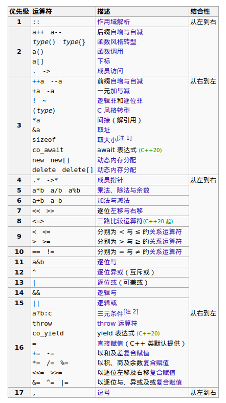

# 目录

<!-- vim-markdown-toc GFM -->

- [基于C](#基于c)
  - [预处理](#预处理)
  - [命名空间](#命名空间)
  - [全局变量](#全局变量)
    - [关于链接](#关于链接)
    - [inline语义](#inline语义)
  - [函数](#函数)
    - [关键字](#关键字)
    - [static变量](#static变量)
    - [默认实参](#默认实参)
    - [重载函数](#重载函数)
    - [函数查找](#函数查找)
  - [可调用对象](#可调用对象)
  - [类](#类)
    - [声明与定义](#声明与定义)
    - [友元](#友元)
    - [成员](#成员)
    - [合成的特种成员何时deleted](#合成的特种成员何时deleted)
  - [特殊的类](#特殊的类)
    - [字面值类](#字面值类)
    - [聚合类](#聚合类)
    - [枚举类](#枚举类)
    - [联合类](#联合类)
    - [嵌套类](#嵌套类)
  - [using用法](#using用法)
  - [语句](#语句)
  - [表达式](#表达式)
    - [列表初始化](#列表初始化)
    - [类型转换](#类型转换)
    - [左值与右值](#左值与右值)
    - [运算符优先级](#运算符优先级)
    - [求值顺序](#求值顺序)
    - [结构化绑定](#结构化绑定)
    - [Lambda表达式](#lambda表达式)
    - [字面值](#字面值)
- [面向对象](#面向对象)
  - [OOP核心思想](#oop核心思想)
  - [作用域](#作用域)
  - [访问控制](#访问控制)
  - [构造函数与特种成员](#构造函数与特种成员)
  - [虚函数](#虚函数)
  - [多重继承](#多重继承)
  - [运行时类型识别](#运行时类型识别)
  - [设计](#设计)
- [泛型编程](#泛型编程)
  - [模板参数](#模板参数)
  - [函数模板](#函数模板)
  - [类模板](#类模板)
  - [变量模板](#变量模板)
  - [变参](#变参)
  - [模板特例化](#模板特例化)
  - [其它](#其它)
  - [编译器类型推断](#编译器类型推断)
  - [元编程](#元编程)
- [其他特性](#其他特性)
  - [内存分配](#内存分配)
  - [成员指针](#成员指针)
  - [volatile](#volatile)
  - [属性](#属性)

<!-- vim-markdown-toc -->
&emsp;混合了C++11/14/17/20的标准，C++20的Big-Four(模块、概念、协程、范围)并没有涉及，等C++23吧，期待...  
文中会有标记写出哪版标准支持该特性，但无标记可不代表都支持哦，
因为。。我忘了时哪版支持的了  
&emsp;本笔记有[精简版](http://note.youdao.com/noteshare?id=7e236a03f9b1f9338a46c792fb7c2a19)用于快速浏览和回忆，不过好久没更了

学习C++时，可以将C++语言分为四大部分 <a href=## title="参照 Effective C++">[注]</a>：
* 基于C
* 面向对象
* 泛型模板
* STL

# 基于C
***此部分按照C++代码中的作用域范围顺序来进行整理排序的，由外到内***  
注意：基于C不代表等于C，现代C++与C有了很大的不同

## 预处理
* 宏替换
    * `#define`
        > 未明确值的宏会替换为0
    * `#undef`
    * `defined(标识符)`
* 条件编译
    * `#if`
    * `#ifdef`
    * `#ifndef`
    * `#elseif`
    * `#else`
    * `#endif`
* 文件引入
    * `#include < >`
    * `#include " "`
    * `__has_include(< >)`
    * `__has_include(" ")`
    * `#pragma once`
* 错误指令
    * `#error 错误消息`
* 更改编译器宏扩展
    * `#line 行号`
    * `#line 行号 文件名`
* 编译器预处理宏
    * `__func__`
    * `__LINE__`
    * `__FILE__`
    * `__TIME__`
    * `__DATE__`
>
## 命名空间
* 基本用法
    > `namespace std { }`
    * 第一次声明为定义，以后为打开
    * 声明在命名空间内的成员可定义在命名空间外，但必须在同一个文件

* 普通命名空间
    * 通过`#include <header>`包含文件内容时，应该先在外引入`<header>`中已经引入的标准库头文件以避免嵌套报错
* 嵌套命名空间
    * 定义在另一个命名空间中，或者 `namespace A::B`
* 内联命名空间
    * inline必须出现在第一次定义处
    * 其内成员名字暴露在外
* 无名命名空间
    * 其内成员不对外链接
    * 其内成员名字暴露在外
* 全局命名空间
    * 通过`::member`引用时，不与**无名命名空间**中成员冲突，但仍会与**内联命名空间**成员冲突
* 命名空间别名
    * `namespace AB = A::B`
* 声明与定义
    * 头文件中的函数与全局变量，要么只提供声明并在lib中提供定义，要么提供inline定义
>

## 全局变量
此处**全局变量**泛指non-local static对象，即声明在全局作用域和其它具名命名空间中的static对象  
类的static数据成员[见下](#static)

### 关于链接
* const与constexpr：  
    被这两个关键字修饰后，默认不对外链接，可以使用**extern**强制对外
* extern：  
    若不指明extern，则该对象会被当作**符号定义**，被当前源文件引用；  
    指明extern后，无初始化器的声明不会被当作定义，于是可以链接其它库中的符号。
 

> 关于引用动态库中的vector的思考：  
> &emsp;vector需要堆内存，故它的构造需要在运行期调用构造函数。  
> &emsp;如果在main函数所在文件的全局作用域定义`vector<string>`，那在main中引用它很简单，进入main前构造`vector<string>`即可  
> &emsp;如果要引用静态库中的`vector<string>`，那和上面情况一样  
> &emsp;如果要引用动态库中的呢？动态库可不会帮我们构造！所以还得在进入main前，动态库数据引用绑定完毕后，
> 调用其构造函数

### inline语义
* 对函数：
    * 提示编译器内联展开以优化性能
    * 若展开失败则保证所有编译单元(**TU**)中的**同名*inline*函数**链接到同一定义
        > 存在多个不同的定义时链接不会报错，而是会选其中一个进行链接
* 对全局变量：
    * 将所有**TU**的同名inline变量链接到同一定义
        > 作用是可以在头文件中定义`inline static`变量而不引起符号重定义的链接错误
* 对函数模板与变量模板：
    * 它们具有隐式`inline`属性。不同的是，不是提示编译器内联展开，只是将多个符号定义链接为同一个
* 对类的static数据成员：
    * 同全局变量，将所有**TU**的同名`inline`变量链接到同一定义，
        可以在类内定义`static inline`数据成员，而无需再在类外定义一次以形成实体  
    * 为模板类提供了定义static数据成员的机制，避免需要将模板的声明与定义分离的麻烦
>

<a href=## title="参考自 Effective C++ 3e 条款30">注</a>：莫要滥用inline函数，特别是构造函数与析构函数，因为
* 构造函数的会捕获成员构造时所抛出的异常并析构已构造的成员（不会调用析构函数），则会有大量的重复调用成员的析构函数，
    特别是第一个构造的成员的析构函数

* 构造函数会调用其数据成员的构造函数，当类的嵌套或继承愈来愈深，构造函数的代码重复便会愈来愈严重
>
**一句话总结就是：inline函数应该满足**
* 规模短小
* 流程直接
* 调用频繁


## 函数
### 关键字
* inline：[见inline语义](#inline语义)：
* constexpr： <span id="constexprhu"></span>
    * 隐式inline
    * 提示编译器，***若将返回值赋值给一个constexpr对象，此函数应该进行编译期计算***
    * 使用限制：<u>不太精准的简化版</u>
        * 参数与返回值：必须是字面值类型（如果有的话）
        * 调用的函数：constexpr函数
        * 定义的变量：字面值类型，且不能有static、thread_local、未初始化变量
* operator：  
    * 重载运算符
    * 自定义字面值： <span id="zdyzmv"></span>  
        例：`double operator""_i2d(unsigned long long t) {return t + 1.0;}`  
        要求：
        * 函数名称只能以下划线`_`开头
        * 参数只能是：
          * `(unsigned long long)`整数`250_i`
          * `(long double)`浮点数`2.5_d`
          * `(const char)`字符`'2'_c`
          * `(const char*, size_t)`C-Style字符串`"string"_s`
* noexcept：
    * 用法：
        * `noexcept`
        * `noexcept(bool)`
        * `noexcept(func)`
            > 只要func声明了noexcept，或没有调用non-noexcept函数且无throw语句则为ture，
            > 一般嵌套再第三种用法中
    * 提示编译器不会抛出异常以进行优化，若最终还是抛出了异常则直接终止程序
    * 限定了**指针**与[虚函数](#xhu)对noexcept属性的传递(类似const修饰)
    * 合成的特种成员会有合成的noexcept声明，自定义的[析构函数](#xghu)若不显式指定也会合成noexcept声明
* return：
    * 若无return语句且返回类型为内置类型（不能为类类型），则默认在最后添加`return 0;`
    * 默认使用移动构造返回对象，且若将返回结果赋值时会直接将return语句的对象赋值给上层栈帧中的被赋值对象

* auto：  
    此时的auto就像是无名的模板参数，可以对auto进行修饰，而要获取其类型时需要对实参调用`typeid(t)`
    * 返回类型推断：
        > `auto test()`
        * 所有返回类型均要相同（可以使用`constexpr-if`绕过）
        * 递归调用之前必须有return以确定返回类型
    * 实参类型推断：
        > `int test(auto& t)`
        * 调用时也可以指定auto的类型`func<int>(1)`
>
* =delete：  
    delete不止可以删除***合成的特种成员***，还可以删除***非成员函数***与***模板实例***  
    * 删除合成的特种成员：default构造、析构、copy操作、move操作
    * 删除成员函数或非成员函数，防止非预期的类型转换
    * 删除一个模板实例，拒绝实例化非预期的模板
        > `template <> void func(bool) = delete` 语法类似模板特例化与模板类型别名


### static变量
* 静态变量，存储于数据段，随函数的链接引用而被引用
* 用于[reference-returning技术](https://github.com/mrbeardad/DotFiles/blob/master/notes/cppstyle.md#%E5%88%9D%E5%A7%8B%E5%8C%96)
>

### 默认实参
* 若某一形参有默认实参，则其后的形参也必须有
* 大概率不会被使用的默认实参的形参则应排在前面
* 定义时不能重复指出默认实参
>

### 重载函数
* 不允许定义形参列表相同的同名函数，即使返回类型不同

* 重载函数之间可通过函数指针区分（函数签名不同）

* 使用[using声明](#using声明)可以引入所有重载函数

* 匹配规则(优先级降序)
    > 注意：
    > * 按规则参数依次匹配，有**默认实参**的参数位可以不用匹配  
    > * 所有能够推断出正确模板实参的模板实例也算在候选函数集中，但同等优先级下非模板优先
    1. 精准匹配、数组与函数蜕化、顶层const转non-const
    2. 非底层const转底层const
    3. 整型提升
    4. 其他内置类型转换
    5. 与类有关的类型转换
>

### 函数查找
* 从当前作用域向前、向外查找，最终到全局命名空间起始处结束
* 根据实参的类型还会到到其所在的命名空间中查找匹配的函数
> 注：若形参为内置类型，则只会常规查找作用域  
> 注：显示指定模板参数的模板函数的ADL为C++20
* 查找的函数：
    * 所有符合上述**匹配规则**的函数，即会对实参进行类型转换尝试
    * 注意对函数模板只会进行类型推断尝试，而不会进行类型转换尝试
>

## 可调用对象
* 调用形式：
    * 函数、函数指针
    * 成员函数指针
    * 成员函数
* 传递形式：
    * 函数指针
    * 成员函数指针
    * 类对象
* 对比优劣：
    * 函数对象相比函数指针：
        * 存储内部状态
        * 类型区分
    * Lambda相比函数对象：
        * 便捷、直观
        * 无default构造函数
>

* 函数参数 <span id="cuxu"></span>

| 类型          | 特性                             |
|---------------|----------------------------------|
| T             | 拷贝                             |
| T&            | 引用、左值(非常量)               |
| T&&           | 引用、右值                       |
| const T&      | 引用、左值、右值、类型转换、只读 |
| temp T&       | 引用、左值、泛型                 |
| temp const T& | 引用、左值、右值、泛型、只读     |
| temp T&&      | 引用、左值、右值、泛型、转发     |

&emsp;函数模板的参数修饰一般用`T&&`，除非确定必须要接收左值`T&`

另外的关于函数参数修饰的讨论[见这儿](https://github.com/mrbeardad/DotFiles/blob/master/notes/cppstyle.md#%E5%87%BD%E6%95%B0%E5%8F%82%E6%95%B0)


## 类
### 声明与定义
* 类的声明：  
    > 声明之后，即可使用该类的指针与引用；  
    > 并可做函数参数与返回类型
* 类的定义：  
    > 获取该类的对象需要先提供定义，因为编译器需要知道该类的对象所需要的栈内存大小；  
    > 并且访问该类的成员（包括数据成员、成员函数等）也需要类的定义。  
* 成员：  
    > 可定义在类外，在名字`classname::member`之后进入类的作用域
>

### 友元
* 友元函数：若无前置声明，此处即为声明

* 友元类：若无前置声明，此处即为声明
* 友元成员函数：需要先提供类的前置定义
* 友元模板：  
    * 某一实例：需要前置声明，并显示指定模板参数 <span id="mbyy"></span>
        > `firend test<int>(Test<int> t);`  
        > 注意显示指出的类型是`Test<int>`中的`int`，而不是你传入的实参的类型`Test<int>`
        > 注意：可声明全特化，不可声明偏特化
    * 整个模板：若无前置声明，此处即为声明
        > `template <typename T> friend test(T t);`
    * 模板参数：
        > `friend T`
* 友元关系无法传递与继承，但基类的友元可以访问其派生类的基类部分
>

### 成员
* 类型成员
    * [using类型别名](#using用法)
    * [using模板类型别名](#using用法)
    * [嵌套类](#嵌套类)
>

* 数据成员
    * 注意构造顺序与数据对齐
    * 类内初始值：只用于编译器推断默认构造函数
    * mutable
    * [const与引用成员无默认构造](#合成的特种成员何时deleted)
    * static： <span id="static"></span>
        * const：non-const的只能定义在类外，const若定义在类内也应该在类外声明以指示符号链接
        * [inline](#inline语义)：可在类内提供定义，而无需再在类外再次声明以形成实体
        * constexpr：隐式inline
        * 可以使用不完整类型，但定义时需提供完整定义
>

* 成员函数
    * 限定this：`const`、`&`或`&&`
    * 定义在类内隐式`inline`
    * static：不会隐式传递`this`，故无法使用non-static成员
    * 修饰符的放置顺序：**const&emsp;&/&&&emsp;noexcept&emsp;final&emsp;override&emsp;=0**
>

* 构造函数 <span id="gzhu"></span>
    > `classname(arglist): initlist {funcbody}`
    * 实现默认构造：
        * =default
        * 无参构造
        * 默认实参
        * 委托构造
    * 单参构造：
        * 隐式类型转换(from)
        * 使用explicit拒绝隐式转换，只能显式调用构造函数
        * 多参数构造也可使用explicit用于拒绝[初始列](#initlist)转换
    * constexpr：
        * 必须初始化所有数据成员（未涉及原本会由编译器推断）
        * 该类无虚基类
        * 其它见[constexpr](#constexprhu)
    * 自定义构造方式：
        * 就地构造
        * 类聚合式构造
        * 逐块式构造
        * 成员模板构造
        * 其他
>

* 析构函数 <span id="xghu"></span>
    > `~classname() {}`
    * 逆序销毁
    * noexcept：不要让异常逃离析构函数，并提供一个接口函数执行析构任务以让用户有处理的机会
        > 当异常发生时会析构当前作用域的对象，若析构这些对象又发生了异常，会导致直接终止程序
    * virtual：将多态基类的析构函数声明为virtual，注意声明virtual析构函数的同时会拒绝编译器合成默认析构函数，
        故需手动定义或者使用`=default`
    * 析构函数若为=delete，则限定该类对象只能通过动态分配创建该对象，且不能销毁（可以通过提供成员函数接口来代替析构函数）
    * 若构造失败，只会销毁已构造的数据成员，不调用该类的析构函数，见[inline](#inline语义)  
        所以若用裸指针数据成员管理资源，出现异常时会发生资源泄漏，应该改用`unique_ptr`
    * 不要在构造函数与析构函数中调用虚函数，因为调用的是静态版本，违反直觉
>

* copy语义
    * copy构造：
        > `ClassName(ClassName&): initlist {funcbody}`
        * 在函数实参构造时会调用
    * copy自赋值：
        * 拷贝新值
        * 销毁旧值
        * 赋值
* move语义
    * move构造：
        > `ClassName(ClassName&&): initlist {funcbody}`
        * 若不为`noexcept`，则标准库容器不会使用移动构造函数
    * move自赋值：
        * 直接拒绝自赋值
>

* 默认比较
    > `auto operator<=>(Type obj)`
    * auto可以指定为：
        * std::strong_ordering  ：字典序比较
        * std::weak_ordering    ：字符串比较忽略大小写
        * std::partial_ordering ：允许忽略无法比较的成员
>

* 类类型转换
    * `operator type() { return type; }`
    * 二义性问题：
        * 存在算术类型和类类型的转换函数，转换为确定的一种类型应该调用哪个转换函数？
            > 转换为类类型则当然就选类类型的转换函数呗；  
            > 如果转换为算术类型，则见下
        * 存在多个算术类型的转换函数，转换为确定的一种算术类型应该调用哪个转换函数？
            > 类与算数类型之间的转换，会发生额外的标准类型转换（只能在标准类型之间转换），
            > 最佳匹配便取决于此。  
            > 包括：精准转换、整型提升、其它算术转换
        * 存在算术类型和类类型的转换函数，且都存在相应形参的重载函数，应该调用版本？
            > 所有用户级别的转换的优先级都相同，故产生二义性
        * 只存在算术类型转换，且存在相应形参的重载函数，应该调用哪个版本？
            > 精准转换更优，整型提升与其它算术转换同等次优
    * 设计建议：
        * 不要在两个类之间定义相同方向的转换，例如，在A中定义由B到A的转换，又在B中定义从B到A的转换
        * 除了bool，最多定义一个与算术类型相关的转换，让编译器自动进行内置类型的转换
            > `explicit operator bool()`在明确需要bool值的地方仍会隐式转换bool值
        * 所有类型转换最好都`explicit`
>

* 重载运算符
    * 除了函数调用运算符，其他不能有默认实参
    * 设计建议：
        * 成员：赋值、调用、和其它单目运算符
        * 友员：对称性运算（算术，关系，位移）
        * 参数与返回值的设计要符合内置类型：
            * 对于接收左值的操作符，限定this与其它参数为左值；否则修饰为const
            * 对于返回左值的操作符，应该返回有效的左值引用；否则返回const
            * 若定义了算术运算符与位运算符，则也应定义复合赋值
            * 关系运算符注意严格弱序
            * 后置自增减调用前缀自增减，以降低维护难度
>

### 合成的特种成员何时deleted
* 析构函数：
    * 有成员无法析构
* 默认构造：
    * 有成员无法默认构造
    * 有成员无法析构
    * 有const或引用成员且无类内初始值
    * 定义了其他构造函数（包括copy构造与move构造）
* 拷贝构造：
    * 有成员无法拷贝构造
    * 有成员无法析构
    * 定义了移动操作
* 拷贝赋值
    * 有成员无法拷贝赋值
    * 有const或引用成员
    * 定义了移动操作
* 移动构造
    * 有成员无法移动构造
    * 有成员无法析构
    * 定义了析构函数、拷贝操作、移动赋值
* 移动赋值
    * 有成员无法移动赋值
    * 有const或引用成员
    * 定义了析构函数、拷贝操作、移动构造

> 一言蔽之，若定义了特种成员中的一个，其它所有特种成员也得重新定义

## 特殊的类
### 字面值类
* 数据成员为字面值类型的[聚合类](#聚合类)
* 若非聚合类，则：
    * 数据成员均为字面值类型
    * 至少有一个constexpr构造函数
    * 类内初始值为constexpr（如果有的话）
    * 使用默认析构函数

### 聚合类
* 定义：
    * 数组
    * 否则：
        * 所有成员与基类都为public
        * 未定义任何构造函数
        * 无virtual函数
        * 注：C++11要求不能有类内初始值
* 聚合初始化： <span id="jhcsh"></span>
    * 默认提供一个特殊构造函数：用花括号按顺序逐个构造**基类**和**数据成员**
    * C++20支持圆括号的聚合初始化从而允许窄化
    * C++20支持在花括号中使用指示符以初始化确定的成员，但仍然需要保持顺序  
        > `{.a_m = 1, .b_m{2}}`，其中`a_m`在`b_m`之前构造
    * 注：与普通的类不同，聚合类与数组类似，默认构造函数未定义

### 枚举类
* 实质：
    * 该类的成员为constexpr整数
    * 该类的对象是这些成员中的一个
* 普通枚举：
    > `enum Num {one, two, three};`  
    > `enum Num: int {one, two, three};`
    * 成员名字对外可见
    * 默认类型由编译器推断
    * 可以赋值给整型变量
    * 不可由整数赋值
* 领域枚举：
    > `enum class Num {one, two, three};`  
    > `enum class Num: int {one, two, three};`
    * 成员名字对外不可见，需要用`::`运算符访问
    * 默认类型为int
    * 不可赋值给整型变量
    * 利用初始列可将整数转换为领域枚举值
* 无名枚举：无对象，可直接使用成员

### 联合类
***C++17中用std::variant<TYPES...>可以完全取代手写 union***
* 实质：用同一块内存存储几种不同类型中的一种，在某时刻存储的类型由用户保证
* 不能是继承体系中的一员，故不能有虚函数
* 匿名union：
    > 编译器自动创建一个无名对象，其成员可直接访问
* 若含有的成员类型有自己的默认构造函数和特种成员则合成的构造和拷贝为delete
    > 原因：联合中存储的值的类型编译时未知，编译器无法调用正确的析构函数来销毁原值
* 通常用类来管理这种union
    > 用匿名union作用数据成员  
    > 用普通枚举对象作判别式追踪union的状态
* 使用定位new：用union中类成员的地址作定位


### 嵌套类
* 作为外层类的一个类型成员
* 外层类和嵌套类相互独立，互相之间并没有特殊访问权限，只是外层类成员在嵌套类中可见
>

## using用法
* 类型别名：
    > `using newtype = oldtype`  
    * 针对类与类型
* 模板类型别名：
    > `template<typename T> using newtype = typename oldtype<T>::Type`
    * 使用方法类似[模板特例化](#模板特例化)
    * 作用目标为模板类或模板类的类型成员(可能需要[typename](#typename))
    * 不能在[块作用域](#block)中使用
* <span id="using声明">using声明</span> ：
    > `using std::member1, std::member2;`
    * 将命名空间或类中的成员引入当前作用域
    * 引入函数时不需要函数签名，故可引入完整的重载函数集
* using指示
    > `using namespace std`
    * 将命名空间所有成员引入当前作用域，若发生名字冲突可以再使用`::`运算符解决(using声明不行)
* using继承： <span id="usingjc"></span>
    > `using D1::D1, D2::D2 ;`  
    > `using T::operator()...` 此形式用于[变参派生](#bcpu)的派生类
    * 类似using声明，将基类部分的成员引入派生类的作用域
        * 改变**优先级**和[**访问控制**](#fwkz)
        * 引入被派生类遮掩的函数（这些函数即使签名不同也会被派生类的同名函数遮掩）
        * 引入不同基类的同名函数可将冲突关系变为重载关系

    * 继承基类的构造函数，提示编译器根据基类构造函数合成派生类的构造函数
        * 不能继承虚基类的构造函数
        * 不能使用变参继承构造函数
>

## 语句
* 分支判断
    * `if( ; )`
    * `if constexpr ( ; )`
        > 一般用于SFINAE以推断函数返回的auto，  
        > 或std::visit(func, variant)设计func
    * `else`
* 开关多分支
    * `switch( ; )`
    * `case IntConstexpr:`
    * `default:`
    * 每个case分支的声明的变量并非分支独有的
    * 不能初始化变量，避免跳过初始化，可以在[块作用域](#block)中初始化(即限制其作用域)
    * 注意break的使用
* do循环
    * `do`
    * `while()`
    * while中检测的变量必须定义在语句外
* while循环
    * `while()`
* for循环
    * `for( ; ; )`
* range-based for
    * `for( ; : )`
    * 允许使用内置数组、初始列作容器
* 异常
    * `try`或`function try`
    * `throw exception;`或`throw;`
        > 重新抛出`throw;`：只能直接或间接出现在catch语句中
    * `catch(exceptiontype)或catch(...)`
* 控制转移
    * continue
    * break
    * ~~goto~~
* 块作用域 <span id="block"></span>
    * 函数体
    * 语句块
    * 注：类与命名空间的作用域不是块作用域

## 表达式
### 列表初始化
<span id="initlist"></span>
* 对于内置标准类型，拒绝丢失精度的转换
* 空的花括号可进行值初始化
* 作用：
    > `test(const string& s)`
    * 用于调用构造函数（**initializer_list优先** ） `test(string{"call default constructor"})`
    * 用于隐式构造为需要的类型（**需要non-explicit构造函数**） `test({"implicitly convert to string"})`
>

### 类型转换
> 不鼓励使用旧式的C-style-cast，下面的新式转换更容易在文件中搜索，且更容易由编译期帮助检测
* `static_cast<>()`&emsp;&emsp;&emsp; ：一般用于将`void*`转换为具体类型的指针等允许但非隐式的转换
* `const_cast<>()`&emsp;&emsp;&emsp;&emsp;：用于取消底层const
* `reinterpret_cast<>()`&emsp;：一般用于转换指针类型
* `dynamic_cast<>()`&emsp;&emsp;&emsp;：用于在继承体系中转换它们的指针或引用
>
***有关指针类型的转换***
* nullptr_t可以转换为任意指针类型，反之不成立
* 任意指针类型可以转换为`void*`，反之不成立
* `const char*`与`char const*`均为底层const；`char* const`才是顶层const

### 左值与右值
* 需要左值：赋值`=`、取地址`&`、自增|减`--` `++`
* 返回左值：赋值`=`、解引用`*`、箭头`->`、下标`[]`、前置自增减`++a`与`--a`
* 可能返回左值：
    * 条件` ? : `，`:`号两边都为左值才会返回左值
    * 成员`.`，`.`左边的对象时左值才会返回左值
>

### 运算符优先级
* 运算符优先级


### 求值顺序
* 有序：
    > 注意，逻辑与和逻辑或的实质就是分支，也会有分支处罚
    * 逻辑与
    * 逻辑或
    * 条件运算符
    * 逗号
* C++17新规则：在下列表达式中，a的求值和所有副作用先序于b，同一个字母的顺序不定。
    * `a.b`
    * `a->b`
    * `a->*b`
    * `a(b1, b2, b3)`
    * `b @= a`
    * `a[b]`
    * `a << b`
    * `a >> b`
* 在一句复合表达式中，若两个子表达式无父子关系，则它们的求值顺序未定
>

### 结构化绑定
* `auto [x, std::ignore, z] = t`
* 可对auto进行限定(const)和修饰(&/&&)
* t的所有public非静态数据成员必须为直接成员或相同基类的直接成员，不能绑定union
* 移动绑定：`auto&& [x, y] = std::move(Pair)`
>

### Lambda表达式
* 形式：`[cap]<temp>(arg){sta}`
    > C++17支持constexpr修饰
* 捕获列表：
    * 捕获类型：
        * 非static的值与引用
        * static值可直接使用
        * 默认以值捕获
    * 隐式捕获：`[=]` `[=, ]` `[&]` `[&, ]`
        > 需要显示捕获`this`，并可以省略`this->`  
    * 表达式初始化新变量
        > 可以在捕获列表中赋值以进行移动绑定 `[t = std::move(cap)](...){...}`
* 参数列表修饰：
    * `[] (auto t) mutable {}`
        > 修饰mutable可以在lambda中修改值捕获的对象
* 完整的泛型模板支持
>

### 字面值
> 定义于：`namespace std::literals`
* `chrono::duration`：
    * 后缀：h、min、s、ms、us、ns
* 数字：
    * 前缀：二`0b或0B`、八`0`、十` `、十六`0x或0X`
    * 后缀：`u`、`l`、`ul`、`ll`、`ull`、`f`
    * 无后缀的整数字面值，其类型为：
        * 若为十进制，为`int` `long` `long long`中的最小者
        * 若不为十进制，为`int` `unsigned int` `long` `unsigned long` `long long` `unsigned long long`
           中的最小者
    * 无后缀的浮点数字面值，其类型为double
* 字符：
    > 默认的C-Style字符串类型为`const char*`，标准提供了一个特殊转换：可以将C-Style-String赋值给`char*`
    * `R"del(string)del"`
    * 前缀（C-char或C-string）：`u8`UTF-8、`u`UTF-16、`U`UTF-32、`L`宽字符
    * 后缀（仅限于C-string）：`s`、`sv`
* [自定义](#zdyzmv)
>

# 面向对象
## OOP核心思想
* <div title="这一点其实在之前便涉及了，即是类的设计和封装">数据抽象</div>
* 继承
* 动态绑定
>

* 继承体系
    * 多态型基类一般都含有virtual函数，每个含有virtual函数的类对象，都在其内部存储有虚指针指向虚表
    * 派生类分成两部分：基类部分，派生部分
    * 空白基类优化（**EBO**）：若基类无数据成员且派生类第一个数据成员类型不是基类类型，则基类部分不分配空间
    * 基类的static成员，对整个继承体系都唯一
    * 声明不能包含基类列表

## 作用域
* 派生部分作用域内嵌于基类部分

* 通过基类的引用或指针调用成员，会根据静态类型进入作用域，并开始逐层向外进行名字查找，
    如果查找到的是虚函数，编译器将其绑定到虚指针上，运行时进行动态绑定
* 作用域名称遮掩规则与正常的有些不同，内层（派生类）作用域中的函数会掩盖外层（基类）的所有同名函数，
    即使它们的函数签名不同，可通过[using继承](#usingjc)或转换函数解决
    <a href=## title="目的是为了防止不小心继承了疏远的基类的函数">[注]</a>
* 访问基类部分需要通过基类接口
    * 派生类：`member`或`base::member`
    * 用户：`derive.member`或`derive.base::member`
* 若基类是类模板，则编译器默认不会进入外层（基类）作用域查找符号
    <a href=## title="因为类模板的具体定义需要实例化是才知晓，而其中可能没有你试图调用的符号">[注]</a>，
    此时便需要如此调用`this->temp_base_func()`

## 访问控制
* virtual继承
* public、proteble、private <span id="fwkz"></span>

* 派生类到基类的转换，需要调用者有访问该派生类的基类部分的权限，  
    即派生类(派生访问说明符)允许访问，  
    且基类(成员访问说明符)也允许
>

## 构造函数与特种成员
* 对基类部分的构造与特种成员，可将基类部分看做派生类的数据成员，成员名字即基类类名
* 派生类的构造函数：
    * [using继承构造](#usingjc)
    * [聚合初始化](#jhcsh)
    * [正常构造](#gzhu)
* 构造、析构时调用虚函数，为静态类型版本
>

## 虚函数
* 必要条件：
    * 非static非模板的非构造函数
    * 必须提供定义
* 关键字修饰：
    * virtual&emsp; ：声明为虚函数
    * final&emsp;&emsp;：拒绝类被继承，拒绝函数被覆盖
    * override ：标记为覆盖虚函数，若并未覆盖则报错
    * =0&emsp;&emsp;&emsp;：声明为纯虚函数，可以不用提供定义(若要定义则定义在类外)，派生类必须覆盖
* 抽象基类：含纯虚函数，不能定义对象
* 默认实参：调用时由静态类型决定（静态绑定）
* 派生类中试图覆盖基类中同名的虚函数，其参数列表和返回类型应该相同，否则会隐藏虚函数，
    > 例外：基类中返回基类的指针或引用，派生类可以返回派生类的指针或引用，前提派生类与基类之间的转换可访问
* 动态绑定 <span id="dtbd"></span>：当通过基类的指针或引用调用虚函数时，会判断该指针或引用的动态类型，
    并调用其动态类型中设计的的虚函数。但构造函数与析构函数中调用的虚函数不会发生动态绑定，即调用静态类型的虚函数版本
>

## 多重继承
* 构造顺序：
    * 由上至下（从基类到派生类）
    * 从左到右（基类列表中的顺序，虚基类优先）
* 名字查找在直接基类中同时进行，若有重名则需要使用作用域运算符，为了避免该潜在二义性：
    * 使用[using继承](#usingjc)将重名的函数引入派生类的作用域
    * 或者设计自己的wrapper，在其中通过`::`作用域运算符进行访问
* 若转换存在多条路径，也会产生二义性错误
>

## 运行时类型识别
* `dynamic_cast<>()`：
    * 转换为目标类型的指针、引用
* `typeid()`：
    * 接受目标类型的对象返回type_info的const引用
    * type_info提供成员`.name()`
>

## 设计
* 利用继承进行递归
    > 利用编译器的运算符表达式解析器，不同表达式的结果均为基类引用或基类指针
    * 定义一个封装基类指针的接口类，用于隐藏基类指针和整个继承体系
    * 该接口类为继承体系中每个类的友元类，并取消继承体系中每个类的public
    * 接口类提供包装的虚函数，继承体系中包含接口类作数据成员
    * 接口类调用包装虚函数，会发生递归调用
    > 直接利用参数包继承也可以实现递归
>

* OOP与Template之间“多态”的区别
    * OOP通过继承体系的运行时转换(动态多态)
        * 需要设计virtual函数并override
        * 可以调用已编译好的库
    * Template通过泛型的编译时实例化(静态多态)
        * 需要设计类的成员供Template调用
        * 需要重新编译源文件(因为template时根据已有的调用实例由编译器自动生成的，而在设计它之前是没有这个实例的)
>

* 利用OOP与Template设计框架
    * OOP：IOStream框架与exception框架  
        利用虚函数动态绑定，用户只需设计派生类并覆盖虚函数
    * Template：STL框架  
        利用重载函数，用户只需设计普通类并重载函数或提供指定成员函数
>

# 泛型编程
## 模板参数
* 模板参数作用域中，不能重用模板参数名
* 用typename指出目标模板的成员为类型，避免与静态数据成员相混淆 <span id="typename"></span>
    > 基类列表与成员初始列中的基类不应该使用typename
* 类型参数：
    * 普通类型
        > `template <typename T>`
    * 模板类型
        > `template <template <typename, auto> class T>`  
        > `template <template <typename...> class T>`  
        > `template <template <auto...> class T>`
* 非类型参数：必须常量表达式
    * 显示指定
        > `template<int INT>`
    * auto推断
        > `template<auto INT>`
* 默认模板参数
    * 类型与非类型都可以有默认模板参数
    * 自动实施于偏特化版本
>

## 函数模板
> `template <typename T> int test(vector<T> t);`
* 自动推断模板参数：
    > `test(vector<int>{})`  
    >
    > 具体规则见[auto推断](#autolxtd)
* 显式指定模板参数：
    > `test<int>(vector<int>{})`
    * 指出无法由实参推断出的模板参数
    * 用于声明[模板友元](#mbyy)时指定其某一实例为友元
    * 用于模板元编程的分支、循环（递归）

* 函数模板的偏序规则：用于判断重载的模板函数中哪个更特例化 <span id="px"></span>
    ```cpp
    template<typename T>
    partial_order_func(T t); // #1

    template<typename T>
    partial_order_func(T* t); // #2

    template<typename T>
    partial_order_func(const T* t); // #3
    ```
    &emsp;规则就是：将模板参数`T`设为类型`X`，则`#1`就是`X`，`#2`是`X*`，`#3`是`const X*`。
    针对`#1`与`#2`，将后者的类型`X*`带入前者的模板，可以成功推断(忽略类型转换)出`T`为`X*`；
    而反过来将`X`带入`#2`的模板，无法成功推断，因为`T*`要求传入的实参必须为指针；
    如此单方面的推断，则表明`#1`的模板参数比`#2`更加泛型，即`#2`比`#1`更加特例化  
    &emsp;**常见的有：**
    * `T*`比`T`更特例化
    * `const T*`比`T*`更特例化
    * `(T1 t1, T1 t2)`比`(T1 t1, T2 t2)`更特例化
>

## 类模板
* 类外使用类模板名字需要用`template <typename T> ... Myclass<T>:: ...`
    > 若定义的是成员模板，则需要两个template，一个是类模板的，一个是成员模板的，初学时会感到奇怪

* 在类模板作用域中使用类名可忽略模板实参
* 显示指定模板参数：
    > `pair<int, double> p{1, 1.0};`
* 自动推断模板参数：
    > `pair p{1, 1.0};`
    * 根据构造函数生成**自动推断向导**以推断模板实参
    * 编译器无法推断嵌套类型或基类类型，需要手写自动推断向导，[详见](https://arne-mertz.de/2017/06/class-template-argument-deduction/)
        > `classname(T1) -> classname<T2::type>;`  
        > 或  
        > `template <typename... T> classname(T...) -> classname<T...>;`  
>

## 变量模板
> `template <typename T> obj = get_val<T>()`
* 根据模板参数(类型或非类型)来方便地生成变量
* 可以用于[元编程技术](#元编程)来编译期获取值
* 不能作为模板模板参数(一种非类型参数)
>

## 变参
* 声明：`template <typename... TYPES>`
* `sizeof...()`获取参数包中参数数量
* 模板类型参数解包
    * 类型修饰
        > `(T&&... t)`与`(C<T...> t)`
    * 基类列表 <span id="bcpu"></span>
        > `template <typename... T> class Deriv: T...;`
    * [using继承](#usingjc)
        > `using T::operator()...;`
* 函数参数解包
    * 递归调用
        > `func(arg1, args...);`  
        > 注意参数包可以为空
    * 左右折叠表达式（模板非类型参数也支持）
        * 一元折叠：`((cout << E << endl), ...)`
            > 表示对E包中每个元素调用逗号左边表达式
        * 二元右折叠：`(E OP ... OP init)`
            > 表示`E1 OP (... OP (EN-1 OP (EN OP init)))`
        * 二元左折叠：`(init OP ... OP E)` 
            > 表示意味着 `(((init OP E1) OP E2) OP ...) OP E2`
>

## 模板特例化
* 全特化：
    > `template<> Class<int, int*> {...};`
* 偏特化：
    > `template<typename T> Class<int, T*> {...};`
    * 只适用于类模板
    * 偏特化模板参数列表是原来的子集或特例化版本
* 作用：
    * 为特殊类型的模板提供特殊的定义
    * 元编程的分支语句
>

## 其它
* <span id="kzslh">控制实例化</span>
    * 避免因为声明和定义不能分离导致多个文件重复模板实例
    * 实例化声明：
        > `extern  template vector<int>`  
        >
        > 编译器遇到模板的使用就会进行实例，故该声明应该在使用之前
    * 实例化定义
        > `template vector<int>`  
        >
        > 实例化定义会实例化类模板的所有成员，而非只实例化使用的
>

* 转发与移动
    ```cpp
    // 转发的目的即是移动
    template <typename T>
    void wrapper(T&& t)
    {
        real(forward<T>(t));
    }
    ```
>

## 编译器类型推断
* auto类型推断与模板类型参数推断： <span id="autolxtd"></span>
    > 注意可能发生推断二义性  
    > 注意`auto t = {1}`会推断`auto`为`initializer_list<int>`
    * 值推断：类似`auto`或`T`
        * 将**引用**视作**对象**
        * 忽略const与volatile
        * 数组与函数退化为指针
        * [类型抵消](#lxdx)

        | 实参类型            | 修饰的模板参数 | 推断出的实参类型 | 左边两者类型抵消后得T的类型 |
        |---------------------|----------------|------------------|-----------------------------|
        | `t或t&`             | T              | t                | T = t                       |
        | `const t或const t&` | T              | const t          | T = const t                 |
        | `std::move(t)`      | T              | t                | T = t                       |

    * 引用推断：类似`auto&`或`T&`
        * 将**对象**视作**引用**
        * 保留const与volatile
        * 保留数组与函数
        * [类型抵消](#lxdx)

        | 实参类型            | 修饰的模板参数 | 推断出的实参类型 | 左边两者类型抵消后得T的类型 |
        |---------------------|----------------|------------------|-----------------------------|
        | `t或t&`             | T&             | t&               | T = t                       |
        | `t或t&`             | const T&       | t&               | T = t                       |
        | `const t或const t&` | T&             | const t&         | T = const t                 |
        | `std::move(t)`      | T&             | t&               | T = t                       |

    * 万能引用推断
        * 将左值对象视作左值引用，右值对象视作右值引用
        * 保留const与volatile
        * 保留数组与函数
        * [类型抵消](#lxdx)与[引用折叠](#yyvd)

        | 实参类型            | 修饰的模板参数 | 推断出的实参类型 | 左边两者类型抵消后得T的类型 |
        |---------------------|----------------|------------------|-----------------------------|
        | `t或t&`             | T&&            | t&               | T = t&                      |
        | `const t或const t&` | T&&            | const t&         | T = const t&                |
        | `std::move(t)`      | T&&            | t&&              | T = t                       |
>
* decltype型推断：
    * 保留const与volatile
    * 保留数组与函数
    * 保留引用类型
    * 对于[返回左值的表达式](#左值与右值)会推断为引用类型
    * 双层括号显式指定为引用
    > 作用：
    > * 尾式返回类型`auto func(auto t) -> decltype(t)`
    > * 与auto合用`decltype(auto) func()`
>
* 类型抵消<span id="lxdx"></span>  
    工作原理即是将推断出的类型（假想的实参的类型）与修饰后的类型（形参的类型）之重叠部分抵消后，得到`T`的类型  
    若后者的修饰符并非前者的子集，则忽略非子集部分：如实参`t&`与形参`const T&`，忽略`const`，得T=t，  
    且最后形参为`const t&`，可以接受`t&`
    * 限定符：const
    * 修饰符：`[]`、`()`、`<>`、`*`、`&`
>
* 引用折叠 <span id="yyvd"></span>
    * `t& &&` => `t&`
    * `t& &`  => `t&`
    * `t&& &` => `t&`
    * `t&& &&`=> `t&&`
## 元编程

元编程：在编译期，利用 **类型推导**与 **类型匹配** 以在编译期对类型进行限定、计算、选择
> 数值的编译期计算倒是其次，类型限定的话C++20有了concepts，  
> 所以主要作用时类型计算与类型选择（可理解为重载函数的选择）

元函数的调用形式：
```cpp
// 获取类型
MetaFunc<T, N>::type    // 利用using类型别名和using模板类型别名
MetaFunc_t<T, N>        // 利用`using模板类型别名`包装`::type`

// 获取值
MetaFunc<T, N>::value   // 利用static const数据成员
MetaFunc<T, N>          // 直接利用`变量模板`取代`::value`，但无法利用static_assert进行编译期判断
MetaFunc()              // constexpr函数，需要将返回值赋值给constexpr对象
```
* 循环：
    * 变参递归，设计参数个数固定的特化模板结束递归
    * 非变参递归，设计最终结束状态的特化模板结束递归
* 分支：
    * 利用特例化的偏序规则进行分支选择
    * 利用`if constexpr (CONSTEXPR_INT)`来实现编译期分支，作用可看作预处理指令`#if CONDITION`，
        只不过前者如果出现在模板之外，仍然会对被丢弃的语句进行语法检测
* 顺序：
    * using类型别名的顺序

# 其他特性

## 内存分配
* `new` `new[]` `delete` `delete[]`
* 定位new：
    * `new (ptr) Type{}`
    * `new (std::nothrow) Type{}`
* new表达式：
    1. 分配内存
    2. 构造对象
    3. 返回指针
* delete表达式：
    1. 销毁对象
    2. 释放内存
* 重载new与delete操作符，重载为类成员隐式static
    * `void* operator new(size_t)`
    * `void* operator new(size_t，nothrow_t&) noexcept`
    * `void* operator new(size_t，align_val_t)`
* 数据对齐：
    * alignas(32)
    * alignof(obj)
* 为不同的类设计new失败时的处理函数
```cpp
// 让需要自定义new_handle的类public继承该类即可，例如`class Test: public NewHandlerSupport<Test>`
template <typename T> // 模板的目的是为了让不同的类继承不同的实例，从而产生不同的static new_handler对象
class NewHandlerSupport
{
public:
    static std::new_handler
    set_new_handler(std::new_handler) noexcept;

    static void*
    operator new(std::size_t);

private:
    static std::new_handler curHandle;
}
```
>

## 成员指针
* `Type Class::* mp {Class.member}`
* `Class.*mp或Classptr->*mp`
* 成员函数指针：
    * 需要通过类的具体对象调用，以填充隐式传递的this
    * 但它并非可调用类型
    * 重载成员函数需要显式指定类型
* 可以利用`function`、`mem_fn`、`bind`将其转换成可调用类型
>

## volatile
* 告诉编译器不要进行优化
* 告诉程序始终从内存中取变量的地址，而不是从缓存或寄存器中取变量的值
>

## 属性
* [[noreturn]]
* [[nodiscard]]
* [[maybe_unused]]
* [[fallthough]]

