<!-- vim-markdown-toc GFM -->

- [数位表示](#数位表示)
  - [整数](#整数)
  - [浮点数](#浮点数)
- [机器代码](#机器代码)
- [处理器结构](#处理器结构)
- [性能优化](#性能优化)
- [硬件组成](#硬件组成)
- [链接](#链接)
- [操作系统](#操作系统)

<!-- vim-markdown-toc -->
> 该笔记是原本的精简版，隐去了太过底层的细节  
> [笔记原本](http://note.youdao.com/noteshare?id=8e8bc1bd1b6105cd97dc35e694eddc9d)放在有道云上了，
> 没转移，又臭又长。。。但是很庆幸自己能坚持下来啦 :smile:  

# 数位表示
## 整数
* 进制的转换
    * 2, 8, 16进制之间的转换：查表即可
        > 记下来当然更好
    * 十进制与其他进制的转换：计算器算呗
>

* 字长
    * 指明的指针的标称大小，也就决定了虚拟地址空间的大小
        > 32位大概4GB，64位大概16EB
>

* 字节顺序
    * 小端：低位在低地址，高位在高地址
        > 大端相反，一般为小端
    * 逆向二进制文件时，一般是一字节一字节地转换
        > 故一个4字节的int被划分为一个一个的字节，它的高位部分其实是在右边的，
        > 而不是我们一般习惯的左边开头
>

* 整数表示
    * 无符型整数：无符型编码 **U**
        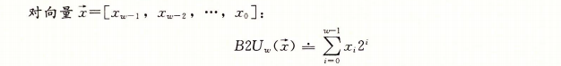
    * 有符型整数：补码编码 **T**
        > 注意补码正负范围不对称，|Tmin| = |Tmax| + 1

        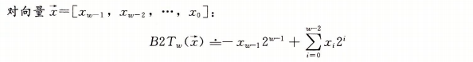
>

* 整数操作
    > **限制从不受信任的源接收数据的数量和格式！**
    * 截断
        > 截断后值域改变从而导致数值可能变化，与**T**相关的截断甚至可能改变符号
    * 扩展
        * 对**T**来说：符号扩展
        * 对**U**来说：零扩展
    * 相互转换
        > 保持底层位模式不变，若长度不同，则先截断或扩展，再重新解释位模式
        * T => U：  
            
        * U => T：  
            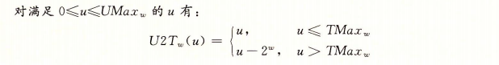
    * 加法运算
        > 完全相同的位级运算
        * **U**加法  
            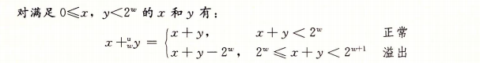
        * **T**加法  
            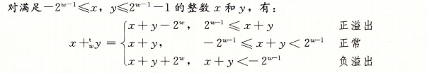
    * 乘法运算
        > 不完全相同的位级运算，但是截断后的结果相同
        * **U**乘法  
            
        * **T**乘法  
            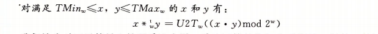
    * 求反运算
        * **T**求反  
            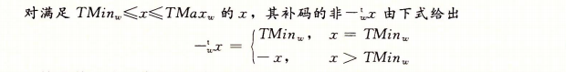
        * **U**求反  
            
    * 常数乘除
        > 可以利用位移运算优化，一般由编译器做展开而不手动优化以致降低可读性
    * 溢出检测
        * **T**：
            * 正负符号错误
        * **U**：
            * 加(减)法  ：结果比两个操作数都要小(大)
            * 乘法      ：`!x || z / x == y`为`true`则`z = x * y`未溢出
    * 位运算技巧
        * 向上舍入  ：`(x + y - 1) / y`
        * 取模      ：截断数位、限制大小、循环往复
        * 位移      ：`-1 << n == pow(-2, n)`
        * 位反      ：`~x == -x - 1`
        * 位与      ：0归零，1取值
        * 位或      ：0不变，1存值
        * 位异或    ：0不变，1取反，同归零
        * 最值      ：
            * `INT32_MAX`为`214...`共9位
            * `INT64_MAX`为`922...`共19位

## 浮点数
* IEEE浮点表示  
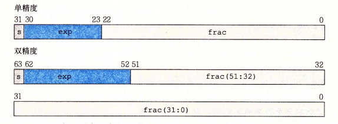
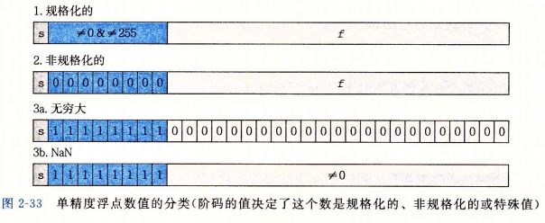
    * $浮点数=尾数\times2^{阶码}$
        > 类似二进制的科学计数法
    * 阶码
        > 规格化数  ：$exp - (2^{k-1} - 1)$  
        > 非规格化数：$1 - (2^{k-1} - 1)$  
        > 目的是：1. 由规格化数平滑过渡到非规格化数；2. 可以用整数比较的硬件来比较浮点数
    * 尾数
        > 规格化数  ：$frac$ 为小数部分，整数部分为$1$  
        > 非规格化数：$frac$ 为小数部分，整数部分为$0$
    * 注意：
        * 浮点数不具备**结合律**且其*加法*不具备**分配律**
            > 因为**精度丢失**与**无穷溢出**
        * 浮点数**加法**具有单调性
            > 若$a\geq b$且$c \neq NAN$，则$a+c\geq b+c$  
            > 而整数因为溢出会导致符号改变，浮点溢出时符号不变，只是变为了无穷值
        * 精度丢失问题
            * 随着浮点数的阶码愈来愈大，其精度也愈来愈差，当大于某个值时，浮点数的精度会大于$1$，
                这也就意味着此时浮点数无法准确表示大于该值的整数了
            * 记住：**int大于$2^{24}$(或long大于$2^{53}$)时float(或double)便无法准确表示一个整数了**
                > float的尾数有23，加上隐含的小数点前面的1，就是24位
            * 记住：**float的十进制有效位数是6，double是15**
                > 一个十进制数字需要用$log_{2}10$位的二进制来表示，那一个二进制位可以表示$\frac{1}{log_{2}10}$
                > 个十进位。对float来说即23位尾数可以表示的十进制数字的位数是$\frac{23}{log_{2}10}\approx6.92$，
                > 即6位十进制数是可以保证正确的，第七位的话是部分正确的(比如因为向偶舍入导致的进位)
    * 浮点数与**T**的转换
        > 丢弃小数部分

# 机器代码
* 汇编代码格式
    > 以ATT格式的汇编代码为例
    * 以`.`开头的行是用于指导汇编器和链接器工作的伪指令
    * 以`:`结束的行是用于标记跳转的地址
    * 数据类型
        > ATT格式要求指令尾缀加上数据类型
        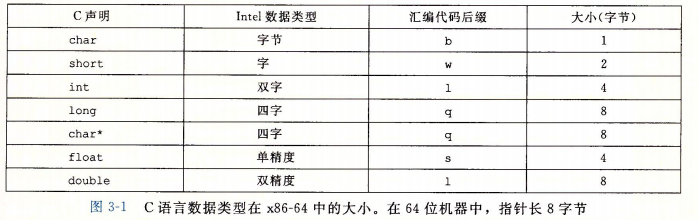
    * 寄存器
        > 其中可由当前函数随意调用的通用寄存器共有9个
        * 被调用者寄存器：即该寄存器属于上级函数，当前函数(**被调用者**)试图占用该寄存器前，
            负责保存里面的值并在函数返回前恢复
        * 调用者寄存器：即该寄存器可以被当前函数(**调用者**)随意使用，但在调用其他函数前需要保存里面的值，
            因为对下级函数来说，该寄存器也可以随意调用而不会保存里面的值
        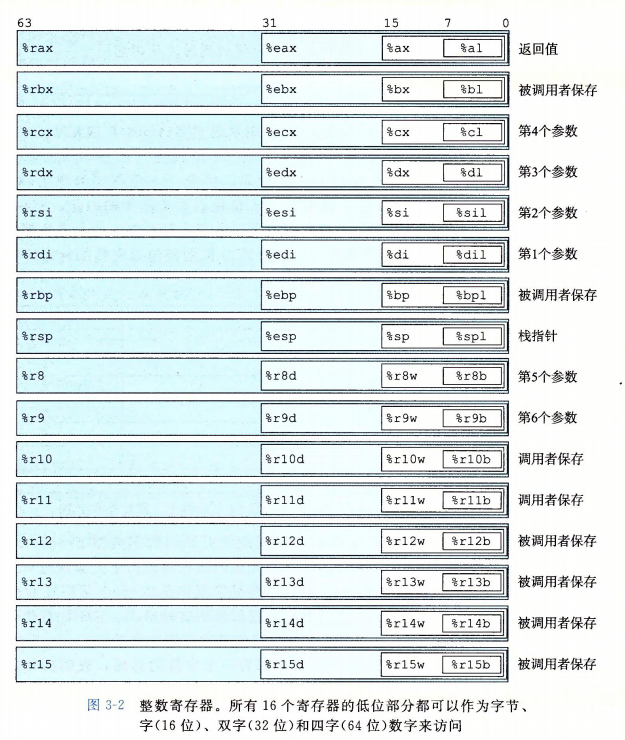
    * 操作数
        > 大多数指令有一个或多个操作数，用以指出该指令需要使用的源数据值，
        > 以及放置结果的目的位置(右操作数)。
        * 立即数
        * 寄存器
        * 内存引用  
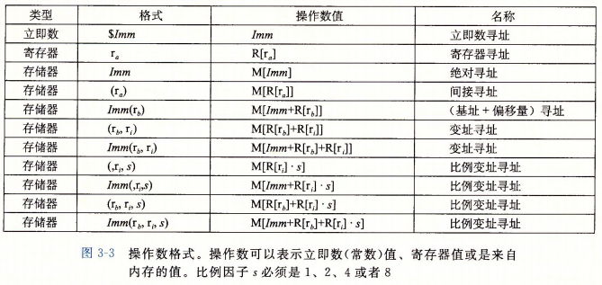

* 机器指令
    * 数据传送(mov)
        > 赋值运算符、整型转换
    * 压栈与弹出(push, pop)
        > 存取栈上(内存)的数据
    * 调用与返回(call, ret)
        > call相当于push %rip; jump func  
        > 即将PC压栈后跳转到制定函数
    * 算术与逻辑操作  
    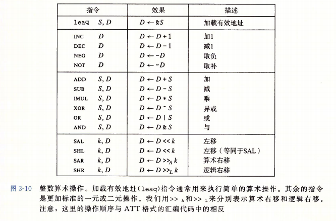
    * 特殊算术操作  
    
    * 测试指令
        > 根据条件码进行测试操作  
        > $CMP S_{1}, S_{2}$ &emsp;基于 $S_{2}-S_{1}$  
        > $TEST S_{1}, S_{2}$&emsp;基于 $S_{1}\&S_{s}$
        * 常用条件码
    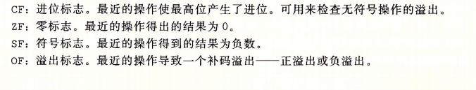
    * 跳转指令  
        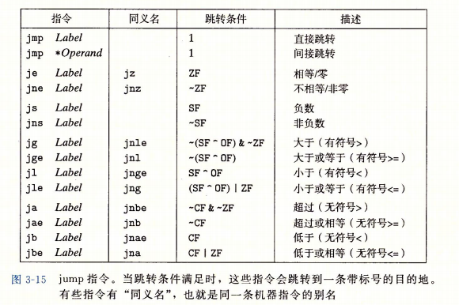
    * 条件赋值
        > 条件表达式

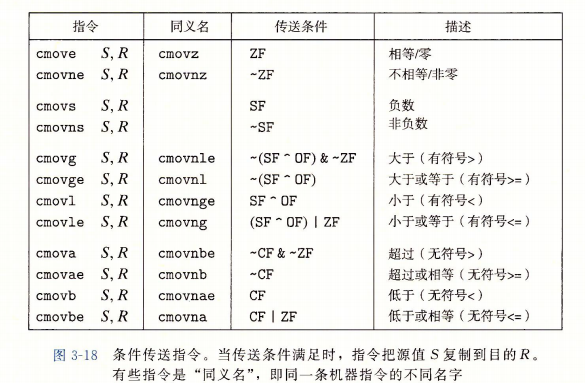
>

* C语句的翻译
    * 分支语句
        * 利用测试指令与跳转指令进行条件检测并跳转
        * 因为CPU会破坏流水线的并行性，而会进行分支预测，分支预测失败会丢弃预测之后的所有操作，
            称之为分支预测处罚，尽量让更可能被执行的分支放在第一条
    * 循环语句
        * do-while
            > 最基本的循环，使用条件检测分支跳转到之前的语句即可
        * jump-to-middle
            > 使用无条件跳转指令直接跳转到do-while的循环结构尾部的条件检测
        * guarded-do
            > 在进入循环前就进行一次条件检测以确认是否进入do-while结构
    * switch语句
        * 通过跳转表的形式进行分支跳转
        * 跳转表：
            * 存储各个分支开始的地址
            * case标签值作下标索引，不存在的对应**case**标签的下标处存储的值是**default**标签的地址
                > 这也是为何要求case标签的值是整型字面值类型，而switch标签值也得是整型
            * switch标签转换为case标签，然后在作为跳转表的下标搜寻将要跳转的地址
                > 转换的意思是，当case标签值中的最小值太大时，会将所有的值加上一个偏移量使最小值为1，
                > 故switch标签也需要加上相同的偏移量
>

* 结构对齐
    * 结构的地址对齐与其成员中的对齐最大的
    * 数组的地址对齐即元素的对齐
    * 大多数的栈帧边界是16字节地址对齐

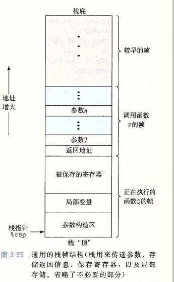</img>
* 运行时栈
    > 左图，从高地址向低地址生长
    * 参数构造
        * 用传值参数传递结构
        * 参数过多寄存器无法全部容纳

    * 返回地址
        * 存放返回到上级函数执行代码的地址

    * 保存寄存器
        > 上面 [寄存器](#register)中提到的需要保存寄存器  
        > 何时需要：
        * 可随意调用的寄存器已使用完
        * 需要基指针
        * 调用其它函数时保存现场

    * 局部变量
        > 何时将值存储到栈上
        * 构造数组与结构
        * 寄存器不足
        * 对一个值取地址

# 处理器结构
* 指令集架构：一个处理器支持的指令和指令的字节级编码称为它的*指令集体系结构(ISA)*
    > 指令集架构所提供的抽象模型将软件设计与硬件设计分割开来
* 硬件描述语言：用文本的形式描述硬件结构
    > 早期的硬件设计是画图，现在是用*硬件描述语言(HDL)*，类似编程，但其描述的是结构而非过程
* 逻辑门：底层电路的设计模型，通过电路的串联、并联、二极管设计出基础的与、或、非三门，
    在由此构造九大门，再复合而成各种控制器是运算器
* 数字系统：
    * 组合逻辑：并不存储值，只输出状态
    * 存储单元：时钟寄存器和随机访问存储器
    * 时钟信号：控制流水线各阶段的运算同步
>

* SEQ结构
    * 取指
    * 译码
    * 执行
    * 访存
    * 写回
    * 更新PC
>

* 现代处理器
    * 超标量：一个周期多个操作，乱序执行
    * ICU结构：
        * 取指单元
        * 译码单元：取出寄存器值并将指令分解为**微操作**
        * 退役单元：每个指令在此挂号，解决数据冒险以及避免控制冒险中预测错误时指令更改程序级状态
    * EU结构：
        * 数据总线
        * 存储单元：对写内存的操作会首先在此挂号地址，数据可以稍后，解决数据冒险
        * 加载单元
        * 分支单元
    * EU性能评定：
        * 延迟：操作完成所需周期数
        * 发射时间：吞吐量(IPC)的倒数
        * 容量：可用于该操作的单元数
        * CPE：每处理一个元素的周期数
        * 延迟界限：某操作所需的最小周期
        * 吞吐量界限：流水线加上指令级并行所需最小周期
    * CPE并发性能计算
        * 流水线  ：$\frac{I\times n + L}{n}，当n远大于L时为I$
        * 指令并行：$\frac{L}{C}$
        * 两者结合：$I / C$，不过会受限于加载单元
>

# 性能优化
* 妨碍优化的因素
    * 内存别名引用
    * 函数调用副作用
* 性能优化
    * 减少函数调用
    * 减少内存引用
    * 寄存器值复用
        > 将寄存器的值写回内存时，注意后面是否还需要该值
    * 循环展开和积累多值
        > 降低循环次数，减少推进循环所做的额外工作  
        > 增加流水线并行效率，并利用了指令级并行  
        > 简单的循环计算可用SIMD代替循环展开
    * 重新结合
        > 减少循环片段，增加不同循环间的并发  
        > 循环片段：这次循环处理的数据，下次又要读  
        > 关键路径：先确定循环变量
    * 存储性能问题
        > 减少循环间WR数据相关性，特别是内存读写  
        > 例：这次循环写i+1，下次又要读i (即上次的i+1)
    * 分支预测问题
        > 更可能的分支放在第一位  
        > 可通过条件运算符来使用条件传送指令
    * 缓存性能问题
        > 降低内循环的步长，降低不命中率  
        > 可以牺牲外循环步长
    * SIMD(一指令多数据)
>

* 程序局部性
    * 时间局部性：将来会重复读写目标
    * 空间局性部：将来会目标附近的数据
    * 利用两者最大化数据缓存的效率
>

# 硬件组成
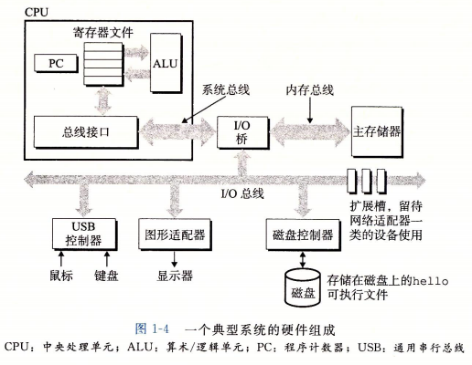
* CPU
    * 执行来自主存中的指令
    * 通过I/O桥与主存、显卡、I/O总线相连
        > 原来所说的北桥现在被集成进了CPU
* 主存
    * 临时存储设备，用来存放程序和程序处理的数据
* 显卡
    * 对图形计算更加高效的处理器
    * 集成显卡直接与显示屏相连
* 总线
    * 贯穿整个系统的电子管道，它负责在各个不见间传递信息
        > 功能：控制总线、地址总线、数据总线  
        > 位置：系统总线、内存总线、I/O总线
    * 总线传送定长的字节块，称为字
        > 现在大多为4字节(32位)或8字节(64位)
* I/O设备
    * 系统与外界相连的通道
        > 一般在南桥之后，也称作外设，例如：硬盘、网卡、键盘、鼠标
    * 它们通过**控制器**或**适配器**与总线相连
        > 控制器与适配器的区别在于封装方式不同：  
        > * 控制器：指I/O设备本身或者主板上的芯片组
        > * 适配器：插在主板插槽上的卡
>

* 存储技术
    * 随机访问存储器
        * SRAM：通电就可一直保持稳定状态
        * DRAM：需要周期性地刷新内存每一位
        * FPM DRAM：快页模式
        * EDO DRAM：扩展数据输出
        * SDRAM：同步
        * DDR SDRAM：双倍数据速率同步
        * VRAM：视频
        * 传统DRAM结构：
            * 芯片单元：超单元矩形阵列，内部行缓冲
            * 内存模块：多个模块连接到内存控制器，每个保存内存地址的一个字节
    * 非易失性存储器
        * PROM：可编程，只能高电流熔断熔丝一次
        * EPROM：可擦写可编程，通过紫外光擦写
        * EEPROM：电子可擦除，Flash
        * 固件：存储在ROM中的程序
    * 本地存储
        * 旋转磁盘(HDD)
            * 组成：扇区，盘面，柱面，磁道
            * 参数：转速，T seek，扇区数/磁道，扇区大小
            * 访问：寻道，旋转，传送
        * 固态硬盘(SSD)
            * 结构：闪存翻译层，块，页
            * 特点：页为单位读写，写前需要擦除块

# 链接
* 静态链接：
    * 静态库：依赖库放在后面且可重复
    * 符号解析：将引用与定义联系起来
    * 重定位：将多文件的各节聚合后，重定位地址引用
    * PIC：利用GOT和PLT实现位置无关代码以备动态共享
    * 链接错误：
        * 未定义的库和错误的路径
        * 多次定义同一符号
        * 多个文件引用的同名且未定义的全局变量为同一个
        * 引用和定义的符号的语言级类型不同
>

* 库打桩机制：
    * 编译时：  
        > 利用宏将`func`替换为你的`wrap_func`
    * 链接时
        > 利用参数`-Wl,--wrap,func`，链接时将`func`链接到`__wrap_func`，将`__real_func`链接到`func`
    * 运行时
        > 修改环境变量`LD_PRELOAD`，如此，程序寻找动态库时会先搜索`LD_PRELOAD`中的模块
>

* 加载与动态链接：
    * shell先frok出子进程，与父进程共享内存 (**写时复制**)
    * 再execv子进程清除并重新映射数据段 (**按需加载**)
    * 开始执行先调用动态链接器加载目标共享库
    * 映射共享库并创建数据段副本
    * 过程引用延迟绑定
    * 进入系统启动函数，再调用main

# 操作系统
* 异常控制流：
    * 异常处理表
    * 进程运行在上下文中，随时可能被操作系统调度
    * 陷入系统调用可能发生：返回错误、信号中断
    * 信号处理中断会随时发生，处理完成后返回主程序
    * 进程组：命令行语句(用管道连接)，父子进程
    * 信号处理技巧：
        * 阻塞信号并一次处理尽可能多的信号
        * 原子性操作
        * 调用异步信号安全函数
    * 非本地跳转：只回滚寄存器中的值
>

* 虚拟内存：
    * 将进程使用的看似连续虚拟内存映射到主存和磁盘的各处
    * 页&emsp;&emsp;：翻译、缓存和内存分配的基本单元
    * 页表&emsp;：MMU将虚拟地址通过页表翻译为物理地址
    * 段&emsp;&emsp;：将一组连续的相关联的虚拟页组织起来
    * 段表&emsp;：用于判断并解决段错误、正常缺页、写时复制、按需加载、共享对象
    * 内核保留虚拟内存：
        * 内核代码、数据
        * 物理内存映射
        * 其他硬件的寄存器映射
        * 进程信息
    * 堆分配：
        * 堆块边界
        * 头部与脚部
        * 类大小空闲块链表数组
    * 内存问题：
        * 正常缺页：页表未加载
        * 段错误：引用未分配虚拟内存
        * 保护异常：读/写/执无权限的段
        * 逻辑错误：修改了合法但错误的内存导致覆盖(元)数据
>

* 系统I/O：
    * 文件：磁盘、终端、网络
    * 访问文件需要：
        * fd-table：进程独有，fork时子进程会继承此项
        * file-table：所有进程共享，包含了读写位置
        * v-node：系统唯一，记录文件的系统中的位置
    * 访问文件：
        * 通过fd进行文件读写
        * 内存映射
    * 不足值：EOF、命令行、socket、pipe
    * IOStream的实现：fd、缓冲区(ptr, cnt)
    * I/O重定向
>

* 并发编程：
    * 进程并发：开销大，IPC不便
    * 线程并发：利用多核
    * 并发问题：
        * 数据竞争、数据销毁：信号量互斥锁
        * 死锁：同序加锁并逆序解锁
    > 同步：逻辑流顺序线性执行  
    > 异步：逻辑流同时并行执行

* 处理器机制：
    * 流水线
    * 指令并行
    * 多核与超线程
    * 多核数据同步
    * 寄存器文件
    * 高速缓存
    * 中断与异常
    * 内核模式与用户模式
    * MMU翻译虚拟内存
    * 外设I/O

* 操作系统：
    * 虚拟内存（地址翻译、内存映射）
    * 进程模型（pid,ppid,pgid,psid,tpgid,uid,euid,gid,egid）
    * 进程间通讯（信号处理、pipe、socket、dbus）
    * 上下文切换（进程并发、线程并行）
    * 故障处理（除零、缺页、保护）
    * 系统调用（I/O文件、访问上下文、访问内核段）
    * 驱动程序（键盘解析，终端渲染，文件系统）
    * 网络协议栈与防火墙（接收/发送/过滤数据包）
    * 本地化配置（日期时间，语系地域，字符编码）

> 该书配套的实验，重装的时候忘保存了。。靠👀️  
> 不过github上由分多值得参考的仓库，不过还是要自己做啦，不能就让我自己受折磨呀🙈️
