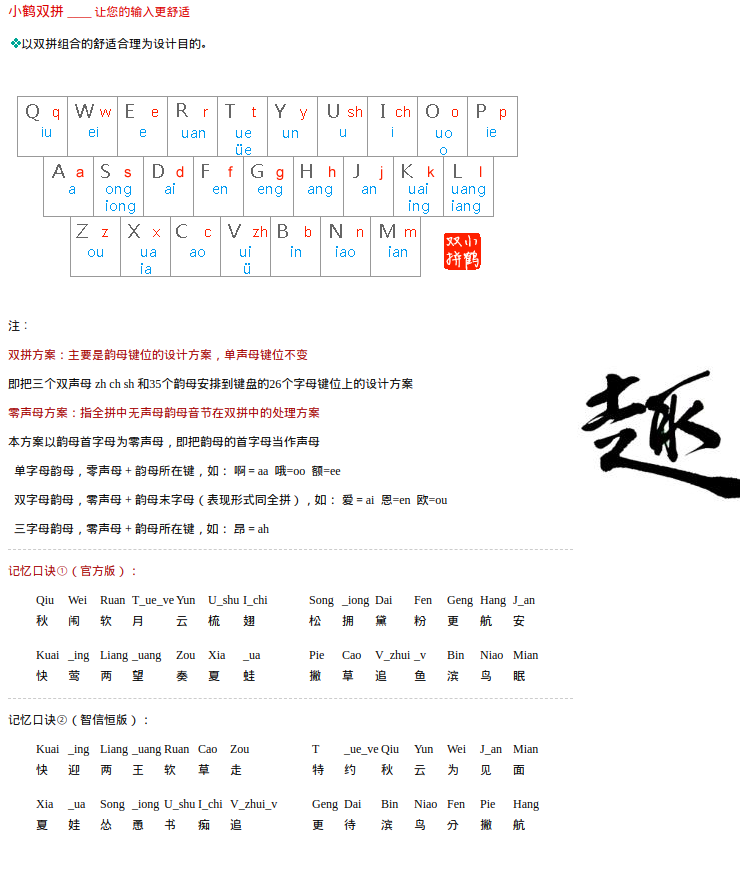

# Flypy小鹤双拼
&emsp;顾名思义，只需要敲两个键就可以打出一个汉字。  
原理是将**声母**与**韵母**全部都映射到26个主键盘字母上．  
一个键可以表示声母，也可以表示韵母。  
&emsp;打字时先按一个键代表声母，例如：`q`代表声母`q`，`u`代表声母`sh`  
再按一个键代表韵母，例如：`q`代表韵母`iu`，`u`代表韵母`u`  
如上，合起来就是`qiu`(秋)和`shu`(梳)

> 声母的位置大家都早已经熟练了，故主要是记忆韵母的位置和`sh` `ch` `zh`的位置  

| 声母: | q    | w          |      | r     | t     | y     | (sh)  | (ch)      |             | p    |
|-------|------|------------|------|-------|-------|-------|-------|-----------|-------------|------|
| 韵母: | (iu) | (ei)       | e    | (uan) | (ue)  | (un)  | u     | i         | (o/uo)      | (ie) |
| 声母: |      | s          | d    | f     | g     | h     | j     | k         | l           |
| 韵母: | a    | (ong/iong) | (ai) | (en)  | (eng) | (ang) | (an)  | (uai/ing) | (iang/uang) |
| 声母: | z    | x          | c    | (zh)  | b     | n     | m     |
| 韵母: | (ou) | (ia/ua)    | (ao) | v(ui) | (in)  | (iao) | (ian) |

| 单韵母: | aa(啊) | oo(哦) | ee(呃) |        |
|---------|--------|--------|--------|--------|
| 双韵母: | ai(唉) | en(嗯) | ou(呕) | er(二) |
| 三韵母: | ah(昂) |

> 小贴士：[ o的发音你会吗 ]( http://m.hanyupinyin.org/yunmu/o-right-fayin.html )  
> 看完你可能发现，tm怎么从小就读错了

* 把一些易错模糊音单独提出来加强记忆：

| 声母或韵母  | 映射    |
|-------------|---------|
| `ue`:`un`   | `t`:`y` |
| `sh`:`ch`   | `u`:`i` |
| `uai`:`uan` | `k`:`r` |
| `ou`:`ao`   | `z`:`c` |
| `iao`:`ian` | `n`:`m` |

| 声母                       | 韵母   |
|----------------------------|--------|
| `q`:`x`                    | `iong` |
| `q`:`j`:`l`:`x`:`n`        | `iang` |
| `sh`:`ch`:`g`:`h`:`k`:`zh` | `uang` |

# RIME
| 按键            | 功能     |
|-----------------|----------|
| ``Ctrl+` ``     | 设置面板 |
| `Ctrl+;`        | 剪切板   |
| `` ` ``         | 笔画反查 |
| `/{char}{char}` | 符号     |

最后一项，是按`/`后，在输入一个数字或两个字母，即可选择插入unicode符号。  
比如，按`/bq`后，即会在候选列表中显示`表情`供你选择。  
更多符号，[见这儿](https://github.com/mrbeardad/rime-dict/blob/master/mysymbols.yaml)
