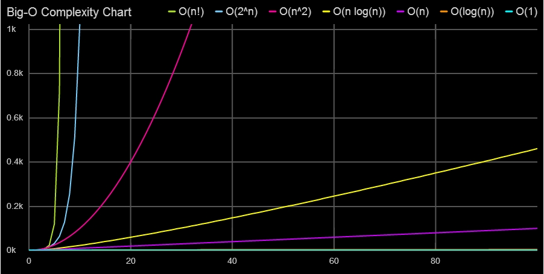
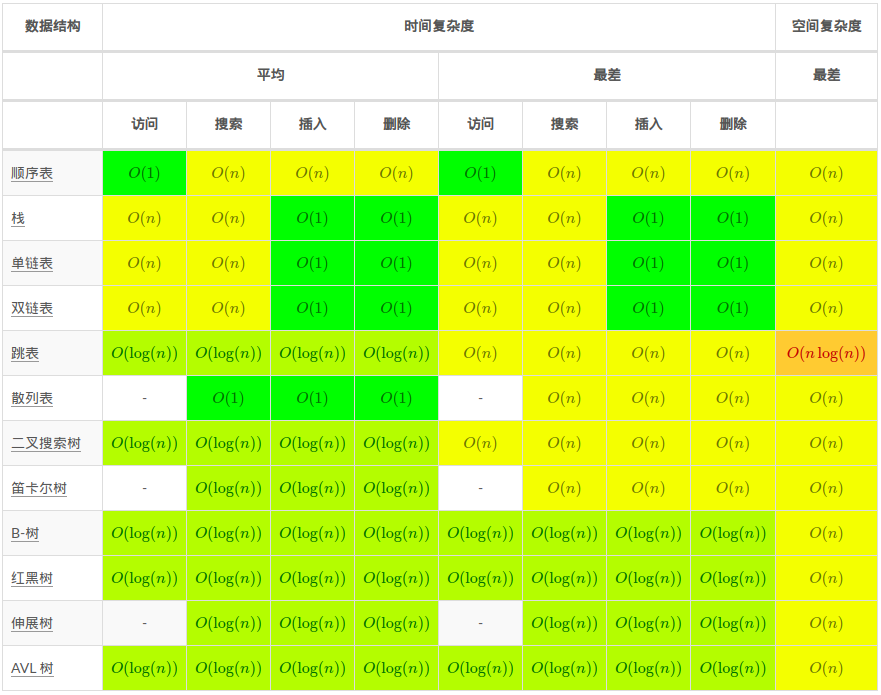
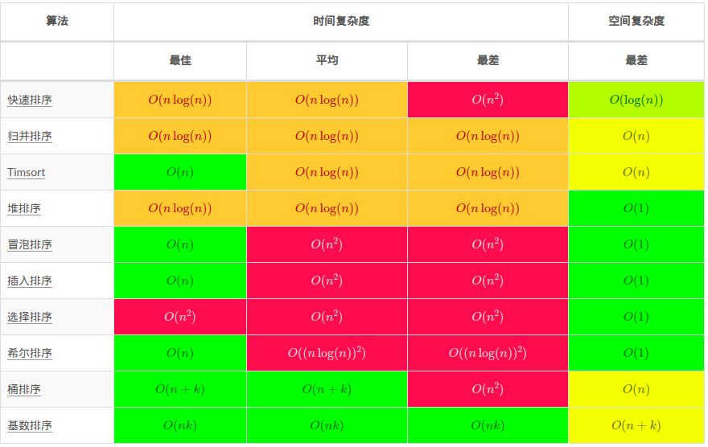

# C++ Style
部分风格参考自[HosseinYousefi/CompetitiveCPPManifesto](https://github.com/HosseinYousefi/CompetitiveCPPManifesto)

## 名字
* 类名、静态变量&emsp;&emsp;&emsp;&emsp;&emsp;：大驼峰拼写法`ExampleName`
* 基本类型别名、动态变量&emsp;：小驼峰拼写法`exampleName`
* 类的数据成员&emsp;&emsp;&emsp;&emsp;&emsp;&emsp;：小驼峰并带`_m`后缀`exampleName_m`
* 模板参数、宏、常量&emsp;&emsp;&emsp;：全部大写和下划线间隔`EXAMPLE_NAME`
* 命名空间、函数名称&emsp;&emsp;&emsp;：全部小写和下划线间隔`example_name`
>
可用于命名标识符的一些通用前后缀：
* 位置：`prev`，`next`，`left`，`right`，`head`，`tail`，`mid`
* 循环：`pos`，`idx`，`this`，`now`，`cur`，`beg`，`end`
* 时间：`new`，`old`，`early`，`late`，`last`
* 计数：`size`，`len`，`num`，`cnt`，`nr`，`dep`，`wid`，`hei`
* 序数：`fst`，`snd`，`last`
* bool：`is`，`not`，`and`，`or`，`any`，`all`，`none`
* 介词：`in`，`on`，`at`，`of`，`2`，`4`
* 类型：`int`，`char`，`str`，`strm`，`ptr`
* 用途：`ret`，`ans`，`val`，`need`，`tmp`，`deal`，`have`

## 注释
* 块注释`/* comment */`：
    * 注释大片代码
    * 源文件标题
* 单行注释`// comment ` ：代码步骤解释
    * 尾后注释：解释<u>*该行*</u>或<u>*该语句块*</u>或<u>*该作用域*</u>的功能
    * 行前注释：解释接下来一段的代码的功能
>
一般使用单行注释，这样可以用块注释来注释大片代码，因为`/* */`内是可以嵌套`//`的，
但是不能嵌套`/* */`

## 括号
* 命名空间、类、函数的花括号下一行开端
* 控制流语句块、多行lambda的花括号同一行开端
* 所有控制流语句都应该用花括号，即使现在只有一行
* 复合表达式中，注意括号的使用以突出显示优先级

## 空格
* template与<>间隔空格，如`template <typename T>`
* 嵌套模板参数的右括号`>`间隔空格，如`vector<vector<int> >`
* 模板参数包`...`与左边隔空格，如`<typename ...T>`；解包与右边隔空格，如`(T&&... args)`
* 函数有关键字inline、constexpr、template、static应该分行写
```cpp
    template <typename T>
    inline int
    test_func(T& t);
```
* 函数名与参数列表不间隔空格
* operator与重载符号结合一般当做函数名，同上
```cpp
    int operator()(int i);
    int operator ""_s(unsigned long long i);
```
* 用4个`<space>`代替`<tab>`
* 指针与引用声明中，`*`与`&`应该与类型放在一起，故引用和指针应该单独一行声明，如`int& r; double* p;`
* 控制流语句的括号需内部空格，控制流语句关键字与括号隔空格，如`if ( get_bool() )`
* else(catch)跟在if(try)语句块末端花括号后面
```cpp
    if ( get_bool() ) {
        //statement
    } else {
        //statement
    }
```
* 二元运算符两边空格，一元只隔一边，三元全隔
* 逗号与分号只与右边隔空格
* 访问控制、case标签、构造函数的冒号只右边隔空格
* lambda函数体超过2行时应该分行
* 函数体、类作用域、命名空间的头尾不留空行
* 各作用域和功能模块之间一般需要隔空行
* 文件末尾加一空行

## 设计经验
> * 头文件保护宏
> * 利用预处理指令做错误处理与条件编译
> * 不对外链接的符号应该都写在无名命名空间中
> * wrap函数尽可能做少的预处理，将操作封装到tool函数
> * 函数模板的形参，若为引用则需要decay
> * 函数nothrow一定`noexcept`
* 注意对函数参数与成员函数this的修饰以增强鲁棒性
* 何时使用指针而非引用：
    * 当需要NULL语义时
    * 当需要更改它的指向时
* 类的单参构造函数若非有意，一定要explicit

## 易错点
* 注意对I/O格式化的要求：
    * istream会忽略前导空格，并注意`cin.ignore()`的使用
    * 大量的非格式化I/O应该使用流缓冲区迭代器，如`istreambuf_iterator<charT>`
    * 浮点数输出：
        * fixed
        * setprecision(n)
        * setw(n)
        * 四舍五入
        * 丢弃小数
* 容器增删元素时，为防止一些对象失效，检查：
    * 是否在**range-based-for**中
    * 是否之前获取了与改容器相关的**迭代器**、**指针**、**引用**
* 循环中，注意stream是否失效
* 使用节点式容器时删除元素前别忘记后移迭代器

## 解题经验
* online，offline：边输入边处理，输入完全后处理
* 抓住题干：
    * 无需保存所有数据，只存储题目需要的
    * 转换题意并找出核心计算问题
    * 逆向思维，由起点到终点，变为求终点的起点

## 选择标准库容器
* vector
    * 无其他需求一般选择vector
* array
    * 固定大小
    * 容量需求大且时间效率优于空间效率
* 内置数组
    * 相对array需要多维线性数组
* deque
    * 需要头部增删元素
    * 容量需求大且空间效率优于时间效率
    * 容量需求过大
* list
    * 需要大量地随处插删
* Pqueue
    * 只需快速找出最值而无需完全排序
* Associated
    * 快速搜索且需要自动排序
    * 注：以下情况考虑用线性数组
        * 元素的比较为整数的比较，且该整数的值域可接受作为下标索引
        * 且元素总量固定，可使用`std::sort()`排序
        * 且允许off-line算法
* Unordered
    * 快速搜索且无需排序
    * 注：以下情况考虑用线性数组
        * 元素的比较为整数的比较，若该整数的值域可接受作为下标索引
* Map
    * 在set的基础上提供更方便的下标操作
    * 只比较key而进行映射集合的分类

# 奇技淫巧

## 循环
* 设计步骤：
    * 设计多重循环时，抓住***各层循环需要更新的循环变量***及其***先后顺序***进行设计  
    * for循环用于***需要初始化变量***和***continue时仍需要迭代变量***的情况，其它情况用while
    1. 首先，
        * 确定<u>循环变量</u>
        * 并思考如何<u>迭代</u>变量
        * 迭代变量的<u>更新步数</u>不确定时，用if{continue;}
    2. 其次，
        * 确定<u>条件检查</u>
        * 可以依据<u>相关关系</u>
        * 注意件优先检测<u>穷尽条件</u>
        * 若<u>until</u>的条件更容易想象，则将其条件取逻辑非即可
    3. 再者，
        * 标记出所有<u>需要更新的变量</u>
        * 确定<u>循环操作</u>的内容
        * 并修正<u>初始状态</u>
        * 若<u>第一次循环</u>需要特殊操作，可以
            * 利用 **once** flag
            * 或者将第一次的循环操作直接提取出来
    4. 然后，
        * 将<u>最终状态的参数</u>带入检查是否正确
    5. <u>尾后处理</u>，例如处理剩余的元素
* 检测条件的确定：循环变量与循环操作的相关关系
    * 同步相关：检测最后操作状态
    * 异步相关**迭前操后**：检测最后操作状态
    * 异步相关**迭后操前**：检测最后操作状态+1

## 分支
首先要明确分支操作所需要的条件
* `if-else`：不可能同时发生的条件
* `if-if`：可能同时发生的条件，必要时可以用`break;`或`continue;`跳过公共语句
* `if-elseif-else`：若两个分支有重合的公共语句，可以转化为`if{if-else}`
* `for{if{break}}`：可以将if{break}的条件并入for中
* `for{if{for}}`：外层for与内层for的检测条件重合时
    * 目的：在某条件下用另一种方式完成循环
    * 合并：外for内嵌if-else，注意变量迭代是否有差异
* `if{for}`：if与for的检测条件重合时
    * 目的：某条件下需要进行循环操作
    * 合并：只要for，if的语义用for的初始条件替代

## 递归
* 设计步骤：
    * 函数功能：明确递归的所有作用、参数、返回值
    * 基准情况：结束递归并保证函数功能符合
    * 一般进展：一次递归只做部分，其余部分调用递归函数做，结合后返回时对调用者也符合函数功能
* 注意：
    * 尾递归尽量地转换成循环语句
    * 递归的结束尽量用**基准情况**来控制，并且尽早的检查结束条件
    * 可以用Stack来存储递归途径

## 步数
* 向量 - 向量 = 距离（同组，从下个向量开始数）
* 距离 +   1    = 数量（从当前向量开始数）
* 向量 +/- 数量 = 下/上一组同位置
* 向量 +/- 距离 = 等距离向量
<br>
</br>

# 数据结构

## 栈
* LIFO表：后进先出
* 单调栈
    压入元素为弹出的元素后续的第一个大/小值
<details>
    <summary><b>humdrum_queue Code...</b></summary>

```cpp
#include <c++/9.3.0/x86_64-pc-linux-gnu/bits/c++config.h>
#include <cstddef>
#include <deque>
#include <functional>
#include <iostream>
#include <utility>
#include <vector>

using namespace std;

template <typename T, typename CMP = less<T> >
struct HumdQue
{
    deque<T> que_m;
    CMP cmp_m;

    void push(const T& val)
    {
        while ( !que_m.empty() && cmp_m(val, que_m.back()) ) {
            que_m.pop_back();
        }
        que_m.push_back(val);
    }

    void pop()
    {
        que_m.pop_front();
    }
};

int main()
{
    ios::sync_with_stdio(false);
    std::cin.tie(nullptr);

    /*
     * 滑动窗口
     */
    constexpr int WIN_SIZE{3};
    HumdQue<pair<int, int> > humdQueue;
    for ( int nr{}, tmp4que{}; cin >> tmp4que; ++nr ) {
        humdQueue.push({tmp4que, nr});
        constexpr int WIN_SIZE_1{WIN_SIZE - 1};
        if ( nr >= WIN_SIZE_1 ) {
            if ( nr - humdQueue.que_m.front().second + 1 > WIN_SIZE ) {
                humdQueue.pop();
            }
            cout << "min(" << nr - WIN_SIZE + 1 << ", " << nr << ") = " << humdQueue.que_m.front().first << endl;
            }
        }

    return 0;
}
```
</details>

## 队列
* FIFO表：先进先出
* 单调队列：
    * 从队尾弹出破坏单调性的元素(类似单调栈)
    * 滑动窗体时判断队首的元素是否为窗体内的元素，否则出队
    * 队首的元素即所求窗口内最值
<details>
    <summary><b>monotonic_stack Code...</b></summary>

```cpp
template <typename T, typename CMP = less<T> >
struct MonoStack
{
    deque<T> stk_m;
    CMP cmp_m;

    void push(const T& val)
    {
        while ( !stk_m.empty() && cmp_m(val, stk_m.back()) ) {
            cout << stk_m.back() << ": " << val << endl;
            stk_m.pop_back();
        }
        stk_m.push_back(val);
    }

    void pop()
    {
        stk_m.pop_back();
    }
};

```
</details>

* 多级反馈队列：优先级高的任务未完成则放入下级队列尾部，操作系统的调度算法

## 树状数组
* 特点：快速进行任意范围的区间操作
* 细节：
    * 父节点管理前面`lowbit(x & -x)`个元素
    * 0索引空缺(0管理0个节点)，数组多开一格
    * 更新节点需要更新所有管理该元素的父节点
    * 询问总和只需获取每个区间的管理者并取和
* 单点修改+区间查询：
    > 数组元素维护自己管理区间的总和
    * `sum_tool(idx)`：询问区间`[1,idx]`的总和，利用`-lowbit(x)`迭代
    * `point_add(idx, val)`：更新所有管理该点的父节点，利用`+lowbit(x)`迭代
    * `range_query(lefy, right)`：`sum_tool(right) - sum_tool(left - 1)`
* 区间修改+单点查询：
    > 数组元素维护该点与前一点的差分
    * `range_add(left, right, val)`：`point_add(left, val); point_add(right + 1, -val)`
    * `point_query(idx)`：`sum_tool(idx)`
* 区间修改+区间查询：
    > 相对上一种类型，额外用一数组`diff`，其元素维护差分`(idx - 1) * BITree[idx]`
    * `range_add(left, right, val, diff)`：BITree数组同上，
        diff数组`point_add(left, (left - 1) * val); point_add(right + 1, (right - 1) * -val)`
    * `range_query(left, right, diff)`：`_sum_tool(right, diff) - _sum_tool(left - 1, diff)`，
        其中`_sum_tool(originIdx, val)`利用`sum = originIdx * BITree[idx] - diff[idx]`求和
<details>
    <summary><b>Code...</b></summary>

```cpp
template <typename T>
struct BITree
{
    vector<T> tree_m;

    explicit BITree(size_t size): tree_m(size + 1) {}

    T sum_tool(size_t idx)
    {
        T sum{};
        for ( int curIdx = idx; curIdx > 0; curIdx -= curIdx & -curIdx ) {
            sum += tree_m[curIdx];
        }
        return sum;
    }

    void point_add(size_t idx, const T& val) // point_change&range_query
    {
        int size = tree_m.size();
        for ( int curIdx = idx; curIdx < size; curIdx += curIdx & -curIdx ) {
            tree_m[curIdx] += val;
        }
    }

    T range_query(size_t left, size_t right) // point_change&range_query
    {
        return sum_tool(right) - sum_tool(left - 1);
    }

    void range_add(size_t left, size_t right, T val) // range_change&point_query
    {
        point_add(left, val);
        point_add(right + 1, -val);
    }

    T point_query(size_t idx) // range_change&point_query
    {
        return sum_tool(idx);
    }

    void range_add(size_t left, size_t right, T val, vector<T>& diff) // range_change&range_query
    {
        range_add(left, right, val);

        int size = tree_m.size();
        auto pointAdd = [&] (int idx, T val) {
            while ( idx < size ) {
                diff[idx] += val;
                idx += idx & -idx;
            }
        };

        pointAdd(left, val * (left - 1));
        pointAdd(right + 1, val * -(right - 1));
    }

    T range_query(size_t left, size_t right, vector<T>& diff) // range_change&range_query
    {
        auto pointQuery = [&] (int idx) {
            T sum{};
            int orgIdx{idx};
            while ( idx > 0 ) {
                sum += orgIdx * this->tree_m[idx] - diff[idx];
                idx -= idx & -idx;
            }
            return sum;
        };

        return pointQuery(right) - pointQuery(left - 1);
    }
};

```
</details>

## ST表
* 特点：对于重叠OP无影响的结果进行快速地任意区间查寻
* 细节：
    * `dp[i][j]`代表区间$[i, i^j-1]$的OP结果
* build()：
    * 初始状态：`dp[i][0]`=`a[i]`
    * 递推方程：`dp[i][j]`=$OP(dp[i][j-1], dp[i+2^{j-1}][j-1]$)
    * 外迭代$j$直到$k$，内迭代$i$直到$i+2^k\gt n$
* query()：
    * `k = log(n)/log(2)`，n表示数量
    * $OP(dp[i][k]，dp[j-2^k][k])$
<details>
    <summary><b>Code...</b></summary>

```cpp
template <typename T>
struct STable
{
    vector<vector<T> > table_m;

    template <typename ITER>
    void build(ITER begin, ITER end)
    {
        while ( begin != end ) {
            table_m.push_back({});
            table_m.back().push_back(*begin++);
        }

        int tableSize = table_m.size();
        for ( int maxPow = log(tableSize) / log(2), curPow{1}; curPow <= maxPow; ++curPow ) {
            for ( int idx{}; idx + (1 << curPow) <= tableSize; ++idx ) {
                table_m[idx].push_back(max(table_m[idx][curPow - 1], table_m[idx + (1 << (curPow - 1))][curPow - 1]));
            }
        }
    }

    T query(size_t left, size_t right)
    {
        int maxPow = log1p(right - left) / log(2);
        return max(table_m[left][maxPow], table_m[right - (1 << maxPow) + 1][maxPow]);
    }
};

```
</details>

## 并查集
* 特点：快速查询与合并类型集合
* 细节：
    * 数组索引作为元素标识，存储内容为上级元素的索引，根的存储内容为负且其绝对值代表高度
* root()：查找目标所在集合的根，并进行路径压缩
* merge()：合并两集合的根，并更新高度
<details>
    <summary><b>Code...</b></summary>

```cpp
struct DisSet
{
    vector<int> vec_m;

    explicit DisSet(size_t size): vec_m(size, -1) {}

    size_t root(size_t idx)
    {
        if ( vec_m[idx] < 0 ) {
            return idx;
        }

        size_t itsRoot{root(vec_m[idx])};
        return vec_m[idx] = itsRoot;
    }

    void merge(size_t root1, size_t root2)
    {
        int& dep1{vec_m[root1]};
        int& dep2{vec_m[root2]};
        if ( dep1 < dep2 ) {
            dep2 = root1;
        } else {
            if ( dep1 == dep2 ) {
                --dep2;
            }
            dep1 = root2;
        }
    }
};

```
</details>

## Trie树
* 特点：快速匹配字符串前缀
* 细节：
可以使用数组实现
    * 每个节点存储flag以判定此节点是否为单词尾部
    * 每个节点存储Umap或vector以判断后续节点是否存在
* 插入：
    * 按前缀一路查询，无匹配则添加节点，尾部节点flag置1
* 删除：
    * 从尾部开始，若无后续字符串清除Umap中的ptr，并销毁节点
* 查询：
    * 按前缀查询完后，flag为true则匹配
<details>
    <summary><b>Code...</b></summary>

```cpp
struct Vertex
{
    array<size_t, 26> next_m;
    bool isEnd_m;
};

struct Trie
{
    vector<Vertex> tree_m;

    explicit Trie(): tree_m{Vertex{}} {}

    void insert(const string& insetStr)
    {
        int trieIdx{};
        for ( char thisChar : insetStr ) {
            size_t& nextIdx{tree_m[trieIdx].next_m[thisChar - 'a']};
            if ( nextIdx == 0 ) {
                trieIdx = nextIdx = tree_m.size();
                tree_m.push_back({});
            } else {
                trieIdx = nextIdx;
            }
        }
        tree_m[trieIdx].isEnd_m = true;
    }

    bool match(const string& matchStr)
    {
        int strIdx{}, strEnd = matchStr.size(), trieIdx{};
        int nextIdx{};
        while ( strIdx < strEnd && (nextIdx = tree_m[trieIdx].next_m[matchStr[strIdx] - 'a']) != 0 ) {
            ++strIdx; 
            trieIdx = nextIdx;
        }
        return strIdx == nextIdx && tree_m[trieIdx].isEnd_m;
    }
};

```
</details>

## 跳跃表
* 特点：快速搜索元素并自动排序
* 细节：
    * 每个元素包含一个多级索引表，其为N级的概率为1/2ⁿ，第N级索引指向后面第2ⁿ个元素
* 搜索：
    * 从每个节点的最高级索引开始搜索
* 插入与删除：
    * 利用0-1分布，决定索引表是否提升
    * 保留每级索引最近的节点并更新
<details>
    <summary><b>noCode...</b></summary>

```cpp
//真的没有
```
</details>

# 哲学思想
***接下来会含有$L^AT_EX$公式，记得安插件哦，看***[这里](https://github.com/mrbeardad/DotFiles/blob/master/notes/csapp.md)

<br></br>

* **由宏及微**  
先确定大目标，再确定小目标，按顺序步骤设计
* **自顶向下**  
需要什么，设计什么；怎么使用，怎么设计
* **面向对象**  
数据抽象，派生继承，动态绑定

## 算法优化
* 找出重复的计算
* 减少多余的拷贝
* 避免重复的访存
>

读取某个内存引用，若在作用域内不可能被某些操作写入，重复引用时可以被编译器优化，
而避免手动将其载入寄存器的麻烦，以下操作便会妨碍优化：
* 传引用参数：函数有多个传引用形参，试图读取其中一个实参，又要写入另一个参数
    > 因为传入的多个引用可能指向同一个对象
* 类成员：试图读取一个类的数据成员，但又要调用同一个类对象的方法
    > 调用的方法(成员函数)可能修改你试图写入的成员
* 全局变量：试图读取全局对象，但又要调用任何函数
    > 任何函数都可能修改全局变量

## 算法设计
* 贪婪：
    * 需要证明局部最优解即全局最优解

* 回溯
    * 利用***DFS***进行多路分叉选择，若选择错误或无选择则函数返回(撤销)重新选择

    * 注意是否可以裁剪掉一些情况

* 分治：
    * 将大问题分解为各类型子问题，各部分递归求解

    * 子问题的解可以用来裁剪掉一些情况

* DP：
    * 问题分解：分治策略拆分出子问题
        > 相邻依赖，状态决策

    * 状态定义：确定记忆表的维度和记录值的语义
        > 前者即影响状态的变量，后者即解决之前状态的解

    * 递推方程：当前解如何依赖之前表中的解推出

    * 初始状态：由最初始解即边界条件决定是否改为循环逆推

# 时空复杂度

## 复杂度标记
* T ≤ O
* T ≥ Ω 
* T = Θ 
* T < o

## 复杂度计算
复杂度合并：
* $T_1 + T_2 = \max(O_1, O_2)$

* $T_1 \times T_2 = O_1 \times O_2$

级数公式：
* $\sum_{i=0}^{N}A^i=\frac{A^{N+1}-1}{A-1}$

* $\sum_{i=0}^{N}A^i\le\frac{1}{1-A}\qquad(0\lt A\lt 1)$

* $\sum_{i=1}^{N}i^k\approx \frac{N^{k+1}}{|k+1|}\qquad(k \ne -1)$

* $\sum_{i=1}^N\frac{1}{i}\approx \ln{N}$

* $F_{k+1}=F_k+F_{k-1}\qquad，则F_{k+1}\lt(5/3)^{k+1}$

## 经典复杂度




# 数论

## 同余与模算术
* 同余方程： 若$(a-b)\%N=0$，则$a\equiv b\mod N$

* 逆元：$b\times b^{ -1 } \equiv 1 \mod N$
    所有$x=b^{-1}+k\times N(k\in Z)$ 都是 $b$ 在模$N$意义下的逆元  
    整数 $b$ 存在逆元的充要条件是 $b$ 与 $N$ 互素

* 取余方程：
    * 计算机运算：整数运算丢弃小数部分`a % b == a - (a / b) * b`

    * $(a+b)\%N = (a\%N + b\%N)\%N$

    * $(a-b)\%N = (a\%N - b\%N + N)\%N$

    * $(a\times b)\%N = (a\%N \times b\%N)\%N$

    * $(a\div b)\%N = (a\times b^{-1})\%N$，$b^{-1}$是$b$ 的逆元
> 推导：
> $$
> (a\div b)\mod N \Rightarrow (a\div b)\times 1\mod N\Rightarrow(a\div b)\times(b\times b^{-1})\mod N
> \Rightarrow(a\times b^{-1})\mod N
> $$
> 故需要 $a$ 可以被 $b$ 整除，因为计算机整数运算中`a/b`会丢弃小数，违反来上述证明必要的数学运算逻辑

如何求逆元：
* 费马小定理：  
    若$b$为整数，$N$为素数，  
    则$b^{N-1} \equiv 1 \mod N$，  
    即$b\times b^{N-2} \equiv 1 \mod N$，$b^{m-2}$就是$b$在模$m$意义下的逆元

* [扩展欧几里得算法](#ny)

## gcd与lcm
* 描述：最大公因数(gcd)与最小公倍数(lcm)
* gcd性质
    * $\gcd(a, b) = \gcd(b, a)$
    * $\gcd(a, b) = \gcd(a-b, b) (a ≥ b)：辗转相减法$
    * $\gcd(a, b) = \gcd(a\%b, b)$
    * $\gcd(a, b, c) = \gcd(gcd(a, b), c)$
* lcm性质
    * $lcm(a, b) = a\times b \div gcd(a, b)$
<details>
    <summary><b>Code...</b></summary>

```cpp
inline int
gcd(int m, int n)
{
    while ( n != 0 ) {
        int tmp{m % n};
        m = n;
        n = tmp;
    }
    return m;
}

inline int
lcm(int m, int n)
{
    return m * n / gcd(m, n);
}
```
</details>

## 扩展欧几里得算法
* 描述：求 $x$ 与 $y$ 使得$a\times x+b\times y=\gcd(a, b)$
* 应用：
    * $ax + by = c$的整数解
        * $x = \frac{c}{g} \times x_0 + \frac{b}{g} \times t$
        * $y = \frac{c}{g} \times y_0 - \frac{a}{g} \times t$
    * 逆元： <span id="ny"></span>
        * $b\times x+N\times y = 1 =\gcd()$
<details>
    <summary><b>Code...</b></summary>

```cpp
int ext_gcd(int a, int b, int& x, int& y)
{
    if ( b == 0 ) {
        x = 1;
        y = 0;
        return a;
    }

    int ans{ext_gcd(b, a % b, y, x)};
    /*
     * 因 ans == b * y + (a % b) * x
     * 又 a % b == a - (a / b) * b
     * 故 ans == b * y + (a - (a / b) * b) * x == x * a + (y - (a / b) * x) * b
     */
    y -= a / b * x;
    return ans;
}
```
</details>

## 排列组合
* 加法原理：同类相加

* 乘法原理：前后顺序

* 容斥原理：加法重叠

* 多重集的排列数：
$$
\binom{n}{n_1,n_2,\cdots,n_k}=\frac{n!}{\prod_{i=1}^kn_i!}
$$
$$
\binom{n}{m}等价于\binom{n}{m,n-m}
$$
* 多重集的组合数：
$$
即求x_1+x_2+\cdots+x_k=r，利用插板法(x_1+1)+(x_2+1)+\cdots+(x_k+1)=r+k
$$
$$
得\binom{r+k-1}{k-1}
$$

## 快速幂运算
* 描述：$a^{23}=a^{0x17}=a^{0b00010111}=a^{0x10}\times a^{0x4}\times a^{0x2}\times a^{0x1}$
<details>
    <summary><b>Code...</b></summary>

```cpp
int quick_pow(int num, int pow) { // 利用指数的二进制分解与指数加法，简化整数的幂运算
    int ret{1};
    while ( pow != 0 ) {
        if ( pow & 0x1 ) { // 如果thisBit为1，则乘以x(现在的x表示当前的指数的x的幂)
            ret *= num;
        }
        num *= num; // 每次循环都更新x，需要时才乘入ret
        pow >>= 1;
    }
    return ret;
}
```
</details>


## 厄拉多塞筛
* 描述：素数的倍数均为非素数，筛掉这些倍数
<details>
    <summary><b>Code...</b></summary>

```cpp
vector<int> prime_sieve(int maxNum) // 筛掉初始值的所有倍数
{
    const int SQRT_N = sqrt(maxNum);
    vector<bool> prime(maxNum + 1, true), ret; // 数组索引标识元素
    for ( size_t num{2}; num <= SQRT_N; ++num ) {
        if ( prime[num] ) { // 跳过已经被排除的元素
            ret.push_back(num); // 半online算法
            for ( size_t needErase{num + num}; needErase <= maxNum; needErase += num ) {
                prime[needErase] = false; // MEM_OPT
            }
        }
    }
    for ( size_t idx{SQRT_N + 1}; idx <= maxNum; ++idx ) {
        if ( prime[idx] ) {
            ret.push_back(idx);
        }
    }
    return ret;
}
```
</details>


## 唯一分解定理
* 描述：每个整数可以被分解为质数的幂的乘积，如$20=2^2\times 3^0\times 5^1$
* 拓展： 从多个数的质数分解式中，选取每个质数的指数的最小值则得到gcd的质数分解式，
    选取最大值则得到lcm的质数分解式
<details>
    <summary><b>Code...</b></summary>

```cpp
vector<int> udt(int num) // 每个正整数都可以分解为唯一的素数的幂的积
{
    vector<int> ret(Primes.size()); // Primes为素数表
    for ( size_t idx{}; num > 0; ++idx ) {
        int thisPrime{Primes[idx]}, pows{};
        auto divd{div(num, thisPrime)};
        while ( divd.rem == 0 ) { // 如果当前的素数为因子，则计算其最大的指数
            ++pows;
            num = divd.quot;
            divd = div(num, thisPrime);
        }
        ret[idx] = pows;
    }
    return ret;
}
```
</details>


# 匹配与排序

## KMP
* 特点：快速匹配模式子串
* 细节：
    * 失配指针next：指向该位置所代表的字符串的一个前缀的后一个位置，该前缀与字符串后缀相等且是所有可能中最长的
    * 计算next：依赖前一个位置的next值，注意前缀的前缀等于后缀的后缀
    * 模式匹配：某个位置匹配失败，则直接将模式串前缀右移到next记录的后缀的位置上
<details>
    <summary><b>Code...</b></summary>

```cpp
struct KMP
{
    vector<int> next_m;
    string pat_m;

    explicit KMP(const string& patStr): pat_m{patStr}
    {
        int lenth = patStr.length();
        next_m.resize(lenth);
        for ( int idx{1}; idx < lenth; ++idx ) {
            int pubLen{next_m[idx - 1]};
            while ( pubLen >= 1 && patStr[pubLen] != patStr[idx] ) {
                pubLen = next_m[pubLen - 1];
            }
            if ( patStr[pubLen] == patStr[idx] ) {
                next_m[idx] = pubLen + 1;
            } else {
                next_m[idx] = 0;
            }
        }
    }

    size_t operator()(const string& cmpStr, size_t begin = 0)
    {
        int cmpIdx{}, cmpEnd = cmpStr.size(), patIdx{}, patEnd = next_m.size();
        while ( cmpIdx != cmpEnd && patIdx != patEnd ) {
            if ( cmpStr[cmpIdx] == pat_m[patIdx] ) {
                ++cmpIdx;
                ++patIdx;
            } else if ( patIdx != 0 ) {
                patIdx = next_m[patIdx - 1];
            } else {
                ++cmpIdx;
            }
        }

        if ( patIdx == patEnd ) {
            return cmpIdx - patEnd;
        } else {
            return UINT64_MAX;
        }
    }
};
```
</details>


## AC自动机
* 特点：快速进行一对多模式匹配
* 细节：
    * 失配指针：指向这样一个节点，它代表的字符串是当前已匹配的字符串的后缀，且是所有可能中最长的
    * 计算fail：依赖父节点的fail，注意将不存在的子节点赋值为其fail的同一子节点的值
    * 模式匹配：失配时跳转到fail指向的节点
<details>
    <summary><b>Code...</b></summary>

```cpp
struct Vertex
{
    array<size_t, 26> children_m;
    int fail_m;
    bool isEnd_m;
};

struct Trie
{
    vector<Vertex> trie_m;

    void insert(const string& str)
    {
        size_t trieIdx{};
        for ( size_t strIdx{}, strLen{str.size()}; strIdx < strLen; ++strIdx ) { // 循环：插入每个字符直到全部插完。迭代：strIdx，trieId
            auto& nextIdx{trie_m[trieIdx].children_m[str[strIdx] - 'a']}; // 附：子节点的索引
            if ( nextIdx == 0 ) { // 如果不存在该子节点，则添加并更新该节点
                nextIdx = trie_m.size();
                trieIdx = nextIdx; // 附：在push_back()前赋值，因为在之后的话容器重新分配导致nextIdx失效
                trie_m.push_back({});
            } else {
                trieIdx = nextIdx;
            }
        }
        trie_m[trieIdx].isEnd_m = true; // 设置该节点为字符串尾部
    }

    template<typename ...T>
    void build(const T&... strs)
    {
        // 初始化根节点，并插入所有模式串
        trie_m.push_back({});
        (insert(strs), ...);

        // 将第一层节点入队，它们的fail_m都指向根节点，代表最长公共前后缀为0
        queue<size_t> bfsQue;
        for ( size_t childIdx : trie_m[0].children_m ) {
            if ( childIdx != 0 ) {
                bfsQue.push(childIdx);
            }
        }

        while ( !bfsQue.empty() ) { // 层序遍历，保证高层节点先处理
            auto& parent{trie_m[bfsQue.front()]};
            bfsQue.pop();
            for ( size_t idx{}; idx < 26; ++idx ) { // 循环：为所有子节点设置fail_m。迭代：idx
                size_t& childIdx{parent.children_m[idx]};
                if ( childIdx == 0 ) { // 若不存在，为避免匹配时递归跳转fail_m，提前将该点设置为fail_m跳转的终点
                    childIdx = trie_m[parent.fail_m].children_m[idx];
                } else {               // 如果存在该子节点，则将它的fail_m指向其父节点的fail_m节点的相同子节点
                    trie_m[childIdx].fail_m = trie_m[parent.fail_m].children_m[idx];
                    bfsQue.push(childIdx);
                }
            }
        }
    }

    int find(const string& str)
    {
        size_t matchCnt{};
        vector<bool> isOnce(trie_m.size(), true); // 记录一个子串是否已被匹配过了
        for ( size_t trieIdx{}, strIdx{}, strLen{str.size()}; strIdx < strLen; ) { // 匹配字符串的每个位置
            auto& childIdx{trie_m[trieIdx].children_m[str[strIdx] - 'a']};
            if ( childIdx != 0 ) { // 如果当前位置代表的子串匹配，则计算所有其自身与其所有后缀是否为字符串结尾
                for ( size_t needCntIdx{childIdx}; needCntIdx != 0 && trie_m[needCntIdx].isEnd_m && isOnce[needCntIdx]; needCntIdx = trie_m[needCntIdx].fail_m ) {
                    matchCnt += 1;
                    isOnce[needCntIdx] = false; // 该子串可能是多个长串的尾缀，避免重复计算
                }
                trieIdx = childIdx;
                ++strIdx;
            } else if ( trieIdx != 0 ) { // 如果不匹配，则跳转到一个最长公共前后缀
                trieIdx = trie_m[trieIdx].fail_m;
            } else { // 已经到根节点了且未匹配，表示不存在尾缀，此时应该从头开始比较
                ++strIdx;
            }
        }
        return matchCnt;
    }
};
```
</details>


## 计数排序
* 特点：时间效率高，空间效率低
* 细节：
    * 使用线性数组索引标记元素，cnt[]数组的索引表示原数组值，存储的值表示该桶中元素的序号，最后遍历原数组，找到cnt中对应的元素的值即为序号，输出并-1
<details>
    <summary><b>Code...</b></summary>

```cpp
vector<int> cnt_sort(iter begin, iter end, int max, int min)
{
    vector<int> cnt(max - min + 1), retSort(end - begin + 1);
    for_each(begin, end, [&](int i){++cnt[i]  - mini];});
    for ( size_t idx{1}, len{cnt.size()}; idx < len; ++idx ) {
        cnt[]idx] += cn[][]tidx - 1];
    }
    for_each(begin, end, ](int i){retSortcnti]] = i;}
}
```
</details>


# 图论
[Code...](https://github.com/mrbeardad/Practices/tree/master/ACM/BOOK/dsaa:c%2B%2B)
## 拓扑排序有向无圈图
* 数据结构：
Vertex{numr; adj;}
Umap<numr, indegree>
queue<idx>
* 步骤：
    * online算法记录indegree
    * 遍历将indegree为0的入队
    * 层序遍历处理出队元素的邻接点：
将adj的indegree-1，若变为0则入队
## 单源无权路径
* 数据结构：
Vertex{dist;  path; adj;}
queue<idx>
* 步骤：
    * 层级遍历处理出队元素的邻接点：
若adj的dist=-1则更新dist与path，并将其入队
## 单源赋权路径
* 数据结构：
Vertex{isInQueue; dist;  path; adj;}
queue<idx>
* 步骤：
    * 层序遍历处理出队元素的邻接点：
若当前dist比adj的dist更优则更新其dist与path
若更新了其dist且未在队列则更新isInQueue且入队
## 关键路径分析有向无圈图
* 数据结构：
Vertex{early; late; prevAdj; nextAdj}
Umap<numr, Vertex> Graph
* 步骤：
    * 添加初始节点0
    * 将动作节点图转换为事件节点图：
0个prev，连到0节点
1个prev，连到那个节点
多个prev，添加哑节点，哑边，真节点，真边
    * 正向bfs最长路(early)
    * 逆向bfs最短路(late)，此时权为相反数
    * dfs计算松弛时间并用stack存储一路都为0的路
## 网络流最大值有向图
* 数据结构：
Vertex{path; pathFlow; nthVisit; umapGf; umapGr}
* 步骤：
    * selectPath(nth)：对Gr图bfs无权最短路
层序遍历处理出队元素的邻接点：
若nthVisit小于nth且到该邻接点的权不为0，则更新path与pathFlow与nthVisit并将其入队
    * 遍历该路径并更新umapGr(target的nthVisit是否未被更新用于判断是否结束，target的pathFlow代表该增长通路的flow)
    * 计算umapGf(find区分Gf中有无反向流)
    * 注：source节点pathFlow置INT32_MAX
## 无向图最小生成树无向连通图
* 数据结构：
Pqueue<{eageWeight, idx1, idx2}>
DisjointSet
* 步骤：
    * 将权重最小的边依次尝试加入(优先队列)
    * 当且仅当该边两节点未在同一集合中(并查集)
    * 直到所有节点连通(eages==vertexs-1)
## 连通性
* 数据结构：
Vertex{isKnown; adj}
* 步骤：
一次dfs可遍历所有节点则图为连通的
## 无圈性
* 数据结构：
Vertex{isKnown; adj}
(stack<idx>)
* 步骤：
    * 多次dfs递归，更新isKnown
    * 递归前设置stack记录路径，返回前弹出，用于判断非树边(无向图无需)
    * 无背向边则无圈
## 无向图割点无向图
* 数据结构：
Vertex{num; low; adj;}
* 步骤：
    * low(v)=min(num(v), min(low(w)), min(num(b)))
    * dfs递归，设置num与low，返回low
    * 对于根节点，有多个儿子则为割点；对于其他节点，num(v) ≤ low(w)则为割点
    * 注：循环adj时区分树边与非树边
## 欧拉回路无向连通图
* 数据结果：
Vertex{umapAdj}
list<idx> result
* 必要条件：
每个节点的边为偶数的连通无向图
* 步骤：
    * 循环一，换一条回路直到pos2insert到头
    * 循环二，list插入、删除边、反向删除边
## 强分支有向图
* 数据结构：
Vertex{numr; adj; revAdj}
map<numr, idx> maxNumr
vector<vector<idx>> branch
* 步骤：
    * 多次dfs，后序遍历设置numr，插入(numr, idx)对到map，反转边
    * 多次dfs，添加branch，从map删除该节点，每次dfs从numr最大者开始
    * 每个branch为强分支
    * 注：第二种dfs需提前为branch提供空位
# 其它算法

## 哈夫曼编码贪婪
* 数据结构：
Node{char, freq, left, right}
Pqueue<NodePtr>
vector<string>
* 步骤：
合并频数最小的两棵trie树(后合并的深度小)
* 证明：
d1*p1+d2*p2 < d1*p2+d2*p1 (d1<d2, p1>p2)
trie树代表的d*p带入上式仍成立
## 平面最近点分治
* 步骤：
    * 功能：接受两个容器，返回范围内最近点距离
    * 基准：一个点返回INF，两个点返回距离
    * 一般：
为递归准备参数容器，一个x排序，一个y排序
为mid准备容器，限定x范围按y排序
计算mid，注意控制转移
## 最优二叉搜索树DP
* 步骤：
    * 最优子结构：
三个节点的三种排列
    * 状态转移方程：
多个节点DP根节点，计算子范围最优排列
    * 记忆表推进：
由下至上扩大范围进行DP，结果用二叉堆表示
## 所有点对最短路DP
* 步骤：
    * 最优子结构：
最初即邻接边的值
两点最短距离由下次循环的更优者代替
    * 状态转移方程：
每对点DP中间节点，计算子范围距离合，若更优则更新该点对的距离
    * 记忆表推进
二维数组记录并用于更新最优值
## 收费公路重建回溯
* 步骤：
    * 由大到小地选择距离，插入在左或在右
    * 插入节点后删除新增的距离
    * 出错则回溯
## 井字棋博弈回溯
* 步骤：
    * 选择所有可走的位置，计算每个位置胜数
    * 预测对方所有可走的位置
    * 递归博弈直到得出结果(胜，败，平)
    * 记忆表记录选择情况(博弈)
    * 裁剪

## 单词代表
* 数据结构：
array (array) UMmap
* 步骤：
    * 替换版：需要区分不同删除位置的代表
    * 删增版：只需区分单词长度
    * 注：同代表的单词中其自身会出现多次

## 子序列最大值(max为负则0)
* 数据结构：
vector<int>
* 步骤：
    * 若前缀为负则可选择下一个非负前缀进行优化
    * 注：记录maxBeg，maxEnd，maxVal，thisBeg，thisEnd，thisMax，nowSum
